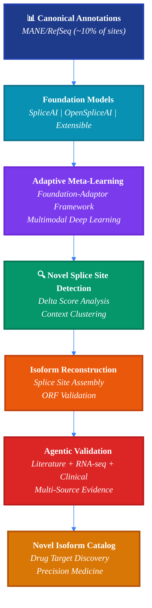
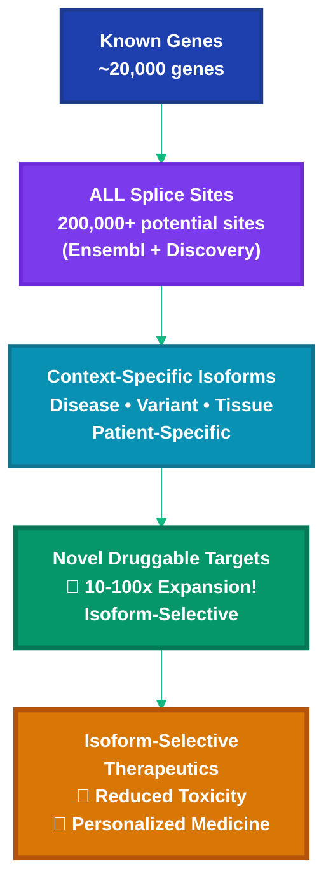
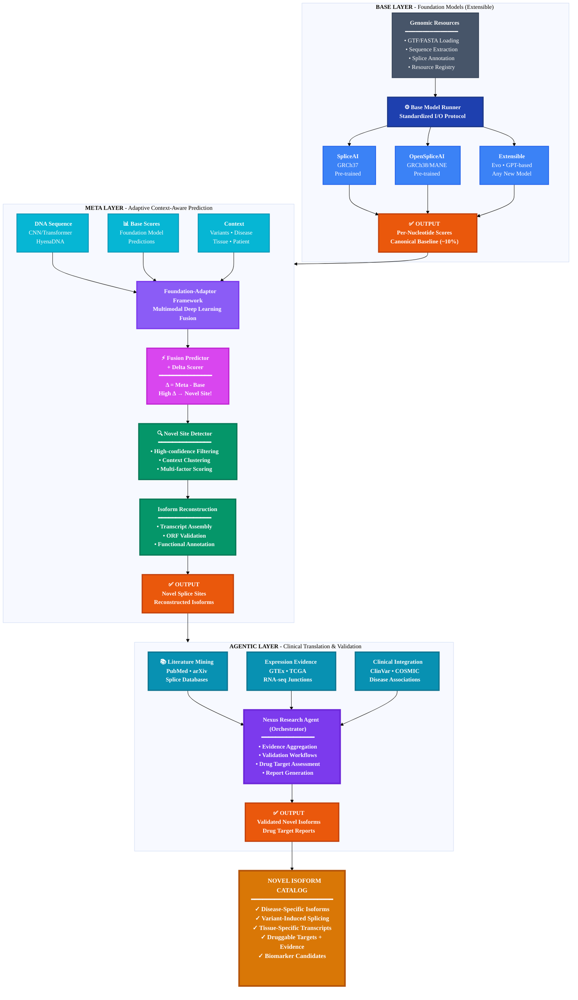

# Agentic-SpliceAI

**Context-Aware Novel Isoform Discovery for Drug Target Identification**

**Agentic-SpliceAI** builds upon the [Meta-SpliceAI](https://github.com/pleiadian53/meta-spliceai) framework, inheriting its powerful base layer and **adaptive meta-learning capabilities** while adding **agentic AI workflows** to enable novel isoform discovery. This next-generation platform discovers disease-specific, variant-induced, and tissue-specific RNA isoforms that go beyond canonical annotations.

By combining **adaptive splice site prediction** through multimodal deep learning, **meta-learning refinement**, and **agentic AI validation**, we enable the discovery of novel therapeutic targets and biomarkers for precision medicine.

---

## 🎯 Vision: From Splice Prediction to Drug Discovery

### The Ultimate Goal: Novel Isoform Discovery

**The Challenge**: Current gene annotations (MANE, RefSeq) only capture ~10% of biologically active splice sites. The remaining **90% includes**:
- 🦠 **Disease-specific isoforms** (cancer, neurological, cardiac)
- 🧬 **Variant-induced splicing** (pathogenic mutations, VUS)
- 🧪 **Tissue-specific isoforms** (brain, immune, developmental)
- 💊 **Druggable novel targets** (oncogenes, splice modulators)

**Our Solution**: **Context-aware adaptive prediction** through multimodal meta-learning discovers novel isoforms:



**Key Innovation**: The **Foundation-Adaptor Framework** uses multimodal deep learning to refine foundation model predictions with context, discovering the 90% of splice sites beyond canonical annotations!

### Why This Matters for Drug Discovery

**Traditional Approach**:
- Target canonical proteins
- Miss disease-specific isoforms
- Limited therapeutic options

**Agentic-SpliceAI Approach**:
- Discover disease-specific isoforms
- Identify druggable splice variants
- Enable isoform-selective therapeutics
- **Expand druggable genome by 10-100x**

---

## 🚀 The Agentic-SpliceAI Advantage

### 1. Extensible Base Layer
**Foundation models**: Pre-trained splice predictors (SpliceAI, OpenSpliceAI, and extensible to any new model)
- Standardized I/O protocol for seamless integration
- Support for GRCh37 (SpliceAI) and GRCh38 (OpenSpliceAI)
- Easy addition of new foundation models (Evo, GPT-based, etc.)

### 2. Adaptive Meta-Learning (Foundation-Adaptor Framework)
**Multimodal deep learning**: Refine predictions using context-aware meta-models
- **Foundation**: Base model predictions (canonical knowledge)
- **Adaptor**: Multimodal fusion (DNA sequence + base scores + context)
- **Context embedding**: Patient variants, disease state, tissue type
- **Self-improvement**: Learn from validation feedback continuously

### 3. Context-Aware Prediction
**Beyond static annotations**: Discover isoforms specific to:
- Patient genetic backgrounds (variant-induced splicing)
- Disease states (cancer, neurological, cardiac)
- Tissue/cell types (brain, immune, developmental)
- Environmental conditions (stress, treatment response)

### 4. Autonomous Validation
**Agentic AI workflows**:
- 🔬 **Validate** with literature, RNA-seq, and clinical databases
- 📚 **Research** biological context and functional impact
- 🧠 **Synthesize** evidence from multiple sources
- 🔄 **Iterate** through multi-agent pipelines

---

## 🔬 The Translational Pathway

### Current State: Limited by Canonical Annotations

**Problem**: Drug discovery limited to ~10,000 annotated protein targets

```
Known Genes (20,000)
    ↓
Canonical Isoforms (~20,000 in MANE)
    ↓
Druggable Targets (~3,000)
    ↓
Approved Drugs (~1,500 targets)
```

**Bottleneck**: 90% of splice sites are non-canonical → **Massive therapeutic potential untapped**!

---

### Agentic-SpliceAI: Expanding the Druggable Genome

**Solution**: Discover context-specific isoforms to expand therapeutic space



**Impact**: 
- 🎯 **10-100x more therapeutic targets** (isoform-specific)
- 💊 **Reduced toxicity** (spare normal isoforms)
- 🧬 **Personalized medicine** (patient-specific isoforms)
- 📊 **Novel biomarkers** (liquid biopsy, companion diagnostics)

### Real-World Example: BRCA1

**Canonical annotation** (MANE):
- 44 splice sites
- 1-2 main isoforms
- Target "BRCA1" broadly

**Full potential** (Ensembl + Discovery):
- 1,218+ splice sites (27x more!)
- 100+ isoforms (tissue/disease-specific)
- Target tumor-specific isoforms selectively

**Drug Discovery Impact**:
- ✅ Identify tumor-specific BRCA1 isoforms
- ✅ Design isoform-selective inhibitors  
- ✅ Avoid normal BRCA1 function (reduced toxicity)
- ✅ Personalize to patient's tumor isoform profile

---

## 🎯 Key Features

### 🧩 Inherited from Meta-SpliceAI (Base + Meta Layers)

| Component | Description |
|-----------|-------------|
| **Extensible Base Layer** | Foundation models (SpliceAI, OpenSpliceAI, + any new model) with standardized I/O |
| **Adaptive Meta Layer** | Foundation-Adaptor framework via multimodal deep learning |
| **Context Integration** | DNA sequences + base scores + patient/disease/tissue context |
| **Tabular Meta-Models** | XGBoost with SHAP interpretability (optional) |
| **Smart Checkpointing** | Chunk-level resumption for genome-scale analysis |
| **Memory Efficiency** | Mini-batch processing for stable memory usage |

### 🤖 NEW: Agentic Workflow Enhancements

| Feature | Description |
|---------|-------------|
| **Literature Validation Agent** | Cross-reference predictions with PubMed, arXiv, and splicing databases |
| **Expression Evidence Agent** | Query GTEx, ENCODE, and tissue-specific expression data |
| **Clinical Annotation Agent** | Check ClinVar, SpliceVarDB, and disease associations |
| **Research Report Generator** | Comprehensive PDF reports with citations and biological context |
| **Self-Improving Pipeline** | Learn from validation feedback to refine predictions |

### 📊 Splice Analysis Tools

- **🧬 Domain-Specific Analysis** - Predefined templates for common splice site analyses
- **🤖 AI-Powered Insights** - LLM-generated visualizations with biological context
- **📊 Publication-Ready Charts** - High-quality plots using matplotlib/seaborn
- **🔬 Exploratory Research** - Ask custom questions about your splice site data
- **🚀 REST API** - FastAPI service for integration with other tools

### 📚 Nexus Research Agent

- **Literature Search** - Automated research on splicing mechanisms
- **Research Reports** - Comprehensive reports with LaTeX equations and citations
- **Multi-Source Integration** - arXiv, PubMed, Europe PMC, Wikipedia
- **Publication-Quality Output** - PDF generation with proper formatting
- **Iterative Refinement** - Multi-agent pipeline (Planner → Researcher → Writer → Editor)

---

## 🏗️ Architecture: Multi-Layer Pipeline to Novel Isoforms

**Three-layer architecture** enabling progression from canonical prediction to novel discovery:



### Layer Responsibilities: The Discovery Pipeline

| Layer | Purpose | Output | Status |
|-------|---------|--------|--------|
| **Base Layer** | Canonical splice prediction (MANE) | Baseline scores for ~10% of sites | ✅ Complete |
| **Meta Layer** | Context-aware adaptive prediction | Novel sites (90% beyond MANE) | 🔄 Phase 4 |
| **Agentic Layer** | Multi-source validation + reports | Validated isoforms + drug targets | 📋 Phase 5-8 |

### Key Innovation: Delta Score Analysis

**The "Aha!" moment**:
```python
delta_score = meta_prediction - base_prediction

if delta_score > 0.3:  # High confidence
    # This splice site is context-dependent!
    # → Novel isoform candidate
    # → Not in MANE canonical set
    # → Validate with RNA-seq, literature, conservation
```

**Why this matters**:
- **Base layer** (SpliceAI/OpenSpliceAI): Trained on canonical annotations → Detects ~10% of sites
- **Meta layer** (Context-aware): Learns from variants, disease, tissue → Detects the other **90%**!
- **Delta score** = Confidence that this is a **real novel isoform**, not noise

---

## 🧬 Why Isoform Discovery Matters

Alternative splicing generates multiple protein isoforms from a single gene, vastly expanding proteome diversity. **Novel isoform discovery is critical for**:

### 🎯 Drug Target Discovery
- **Oncogene isoforms**: Cancer-specific splice variants as selective targets
- **Splice modulators**: Small molecules targeting disease-specific splicing
- **Isoform-selective drugs**: Therapeutics that spare normal isoforms
- **Companion diagnostics**: Isoform biomarkers for patient stratification

### 🔬 Precision Medicine
- **VUS interpretation**: Variant-induced splicing changes clarify pathogenicity
- **Disease mechanisms**: Isoform switching in disease progression
- **Biomarker discovery**: Tissue and disease-specific isoforms
- **Therapeutic monitoring**: Isoform changes as treatment response markers

### 🧪 Translational Research
- **Functional genomics**: Linking genotype to isoform to phenotype
- **Disease modeling**: Context-dependent splicing in cell/animal models
- **Therapeutic development**: Target validation and lead optimization
- **Clinical trials**: Isoform-based patient selection

---

## 🚀 Quick Start

### Splice Analysis

#### Option 1: REST API Service (Recommended)

**Start the service:**

```bash
cd agentic_spliceai/server
mamba run -n agentic-spliceai python splice_service.py
```

**Access the API:**
- Swagger UI: http://localhost:8004/docs
- API Root: http://localhost:8004

**Example API call:**

```bash
curl -X POST http://localhost:8004/analyze/template \
  -H "Content-Type: application/json" \
  -d '{
    "dataset_path": "data/splice_sites_enhanced.tsv",
    "analysis_type": "high_alternative_splicing",
    "model": "gpt-4o-mini"
  }'
```

#### Option 2: Python Library

```python
from agentic_spliceai import create_dataset
from agentic_spliceai.splice_analysis import generate_analysis_insight
from openai import OpenAI

# Load dataset
dataset = create_dataset("data/splice_sites_enhanced.tsv")

# Generate analysis
client = OpenAI()
result = generate_analysis_insight(
    dataset=dataset,
    analysis_type="high_alternative_splicing",
    client=client,
    model="gpt-4o-mini"
)

# Save and execute code
with open("analysis.py", "w") as f:
    f.write(result["chart_code"])

# Execute to generate chart
exec(result["chart_code"])
```

### Nexus Research Agent

Generate comprehensive research reports on splicing topics:

```bash
# Generate research report on splicing mechanisms
nexus "Alternative Splicing Mechanisms in Cancer" --pdf

# Research specific splicing topics
nexus "SpliceAI Deep Learning Architecture" \
  --model openai:gpt-4o \
  --length comprehensive

# Quick literature review
nexus "Recent advances in splice site prediction" \
  --model openai:gpt-4o-mini \
  --length brief
```

**Python API:**

```python
from nexus.agents.research import ResearchAgent
from nexus.core.config import Config

# Initialize research agent
config = Config()
agent = ResearchAgent(config)

# Generate research report
result = agent.research(
    topic="Splice Site Recognition by U1 snRNP",
    length="standard",
    generate_pdf=True
)

print(f"Report saved to: {result['output_path']}")
```

**Use Cases:**
- Research latest splicing mechanisms before analysis
- Generate literature reviews for grant proposals
- Stay updated on splice prediction methods
- Validate analysis approaches with current research
- Generate comprehensive background sections

### Splice Site Prediction

Predict splice sites using state-of-the-art models:

```bash
# CLI: Predict for genes
agentic-spliceai-predict --genes BRCA1 TP53 UNC13A

# CLI: Predict for chromosome
agentic-spliceai-predict --chromosomes 21 --base-model openspliceai
```

**Python API:**

```python
from agentic_spliceai.splice_engine import predict_splice_sites

# Simple prediction
results = predict_splice_sites(genes=["BRCA1", "TP53"])
positions = results["positions"]

# High-confidence predictions
import polars as pl
high_conf = positions.filter(pl.col("donor_score") > 0.9)
```

**Use Cases:**
- Predict splice sites for genes of interest
- Genome-wide splice site analysis
- Validate predictions against annotations
- Generate training data for meta-models

**See**: [Splice Prediction Guide](docs/SPLICE_PREDICTION_GUIDE.md) for complete documentation

## 📊 Predefined Analysis Templates

### 1. High Alternative Splicing
**Identifies genes with the most splice sites**

Genes with many splice sites often undergo extensive alternative splicing, crucial for protein diversity.

```python
analysis_type = "high_alternative_splicing"
```

### 2. Genomic Distribution
**Visualizes splice site distribution across chromosomes**

Reveals gene density and transcript complexity patterns across the genome.

```python
analysis_type = "splice_site_genomic_view"
```

### 3. Exon Complexity
**Analyzes transcript structure by exon count**

Shows relationship between exon count and splice site density.

```python
analysis_type = "exon_complexity"
```

### 4. Strand Bias
**Analyzes strand distribution of splice sites**

Reveals genomic organization and potential annotation biases.

```python
analysis_type = "strand_bias"
```

### 5. Transcript Diversity
**Identifies genes with most transcript isoforms**

High transcript diversity indicates complex alternative splicing patterns.

```python
analysis_type = "gene_transcript_diversity"
```

## 🔬 Exploratory Analysis

Ask custom research questions:

```python
from agentic_spliceai.splice_analysis import generate_exploratory_insight

result = generate_exploratory_insight(
    dataset=dataset,
    research_question="What is the relationship between gene length and splice site density?",
    client=client
)
```

**Example questions:**
- "How do splice sites distribute across different gene biotypes?"
- "Which chromosomes have the highest alternative splicing rates?"
- "What is the average exon count for highly expressed genes?"
- "Are there differences in splice site patterns between coding and non-coding RNAs?"

## 📦 Installation

### Prerequisites

```bash
# Python 3.9+
python --version

# Create environment for agentic-spliceai
mamba env create -f environment.yml
mamba activate agenticspliceai
```

### Install Dependencies

```bash
# Install package in development mode
cd agentic-spliceai
pip install -e .
```

> **Note**: This project is designed to run independently with its own environment and dependencies.

### Set Up Environment

```bash
# Copy environment template
cp .env.example .env

# Edit .env and add your OpenAI API key
# OPENAI_API_KEY=sk-...
```

## 🗂️ Project Structure

```text
agentic-spliceai/
├── src/
│   └── agentic_spliceai/
│       │
│       ├── splice_engine/           # 🧬 Core splice prediction (ported from meta-spliceai)
│       │   │
│       │   ├── config/              # Configuration management
│       │   │   ├── genomic_config.py    # Config dataclass & loader
│       │   │   └── settings.yaml        # Default settings
│       │   │
│       │   ├── resources/           # Genomic resource management
│       │   │   ├── registry.py          # Path resolution for GTF/FASTA/models
│       │   │   └── schema.py            # Column standardization
│       │   │
│       │   ├── utils/               # Shared utilities
│       │   │   ├── dataframe.py         # DataFrame operations
│       │   │   ├── display.py           # Printing & formatting
│       │   │   └── filesystem.py        # File I/O helpers
│       │   │
│       │   ├── base_layer/          # Base model predictions
│       │   │   ├── models/              # SpliceAI, OpenSpliceAI configs
│       │   │   │   ├── config.py            # BaseModelConfig
│       │   │   │   └── runner.py            # BaseModelRunner
│       │   │   ├── data/                # Data types
│       │   │   │   └── types.py             # GeneManifest, PredictionResult
│       │   │   ├── prediction/          # Prediction workflows (WIP)
│       │   │   └── io/                  # I/O handlers (WIP)
│       │   │
│       │   └── meta_layer/          # Meta-learning layer
│       │       ├── core/                # Configuration & schema
│       │       │   ├── config.py            # MetaLayerConfig
│       │       │   └── feature_schema.py    # Feature definitions
│       │       ├── models/              # Neural network models (WIP)
│       │       ├── training/            # Training pipeline (WIP)
│       │       └── inference/           # Inference pipeline (WIP)
│       │
│       ├── agents/                  # 🤖 Agentic workflows (WIP)
│       │   ├── validation/              # Literature validation agent
│       │   ├── expression/              # Expression evidence agent
│       │   └── clinical/                # Clinical annotation agent
│       │
│       ├── server/                  # FastAPI service
│       │   └── splice_service.py
│       │
│       └── analysis/                # Analysis tools
│           ├── data_access.py           # Dataset loading
│           ├── splice_analysis.py       # Analysis templates
│           └── planning.py              # Chart code generation
│
├── nexus/                           # 📚 Research agent package
│   ├── agents/                      # Multi-agent pipeline
│   │   ├── research/                    # Research orchestrator
│   │   ├── planner/                     # Research planning
│   │   ├── researcher/                  # Information gathering
│   │   ├── writer/                      # Report writing
│   │   └── editor/                      # Report refinement
│   ├── core/                        # Core utilities
│   ├── cli/                         # CLI interface
│   └── templates/                   # Report templates
│
├── data/                            # Data directory (symlinked)
│   ├── ensembl/GRCh37/              # Ensembl annotations
│   ├── mane/GRCh38/                 # MANE annotations
│   └── models/                      # Pre-trained model weights
│       ├── spliceai/
│       └── openspliceai/
│
├── docs/                            # Documentation
├── tests/                           # Unit tests
└── pyproject.toml                   # Package configuration
```

## 🧪 Example Workflow

### 1. Load Your Data

```python
from agentic_spliceai import create_dataset

# Supports TSV, CSV, Parquet, SQLite
dataset = create_dataset("data/splice_sites_enhanced.tsv")

# Inspect schema
print(dataset.get_schema_description())
```

### 2. Generate Analysis

```python
from agentic_spliceai.splice_analysis import generate_analysis_insight
from openai import OpenAI

client = OpenAI()

# Use predefined template
result = generate_analysis_insight(
    dataset=dataset,
    analysis_type="high_alternative_splicing",
    client=client,
    model="gpt-4o-mini"
)

print(f"Title: {result['title']}")
print(f"Description: {result['description']}")
print(f"\nGenerated code:\n{result['chart_code']}")
```

### 3. Execute and Visualize

```python
# Save code
with open("splice_analysis.py", "w") as f:
    f.write(result["chart_code"])

# Execute
exec(result["chart_code"])
# This generates and displays the chart
```

### 4. Customize and Iterate

```python
# Review the generated code
# Modify as needed
# Re-execute

# Or use reflection for automated refinement
result = generate_analysis_insight(
    dataset=dataset,
    analysis_type="high_alternative_splicing",
    client=client,
    enable_reflection=True,
    max_iterations=3
)
```

## 🌐 API Endpoints

### GET /analyses
List available analysis templates

```bash
curl http://localhost:8004/analyses
```

### POST /analyze/template
Generate analysis using predefined template

```bash
curl -X POST http://localhost:8004/analyze/template \
  -H "Content-Type: application/json" \
  -d '{
    "dataset_path": "data/splice_sites_enhanced.tsv",
    "analysis_type": "high_alternative_splicing",
    "model": "gpt-4o-mini"
  }'
```

### POST /analyze/exploratory
Generate custom exploratory analysis

```bash
curl -X POST http://localhost:8004/analyze/exploratory \
  -H "Content-Type: application/json" \
  -d '{
    "dataset_path": "data/splice_sites_enhanced.tsv",
    "research_question": "What is the distribution of splice sites by chromosome?",
    "model": "gpt-4o-mini"
  }'
```

## 🔧 Configuration

### Environment Variables

```bash
# Required
OPENAI_API_KEY=sk-...

# Optional
SPLICE_AGENT_PORT=8004
SPLICE_AGENT_HOST=0.0.0.0
SPLICE_AGENT_DATA_DIR=data/
SPLICE_AGENT_OUTPUT_DIR=output/splice_charts
```

### Supported Models

- `gpt-4o-mini` - Fast and cost-effective (default)
- `gpt-4o` - More capable for complex analyses
- `gpt-5-mini` - Latest fast model
- `gpt-5` - Latest capable model
- `gpt-5.1-codex-mini` - Optimized for code generation

## 📚 Data Format

Splice Agent expects datasets with the following columns:

**Required:**
- `chrom` - Chromosome (e.g., chr1, chr2, ..., chrX, chrY)
- `position` - Genomic position (0-based or 1-based)
- `site_type` - Splice site type (donor or acceptor)
- `strand` - Strand (+ or -)

**Optional but recommended:**
- `gene_name` - Gene symbol (e.g., TP53, BRCA1)
- `gene_id` - Gene identifier
- `transcript_id` - Transcript identifier
- `exon_rank` - Exon number in transcript

**Example data:**

```tsv
chrom	position	site_type	strand	gene_name	transcript_id	exon_rank
chr1	12345	donor	+	TP53	NM_000546.6	5
chr1	12678	acceptor	+	TP53	NM_000546.6	6
```

## 🎓 Learning Resources

### Documentation
- [API Documentation](docs/API.md) - Complete API reference
- [Biology Background](docs/BIOLOGY.md) - Splice site biology primer
- [Tutorial](docs/TUTORIAL.md) - Step-by-step guide

### Examples
- [analyze_splice_sites.py](examples/analyze_splice_sites.py) - Full CLI tool
- [quick_start.py](examples/quick_start.py) - Quick examples

### Related Projects
- [Meta-SpliceAI](https://github.com/pleiadian53/meta-spliceai) - Original research implementation with base and meta layers
- [Agentic AI Lab](https://github.com/pleiadian53/agentic-ai-lab) - Nexus Research Agent and agentic workflows

## 🤝 Contributing

Splice Agent is designed to be extensible. Contributions welcome!

**Add new analysis templates:**
1. Add template to `splice_analysis.py::ANALYSIS_TEMPLATES`
2. Include SQL query, chart prompt, and biological context
3. Test with sample data
4. Submit PR

**Add new data sources:**
1. Implement `ChartDataset` interface in `data_access.py`
2. Add format detection logic
3. Test with real data
4. Submit PR

## 📄 License

MIT License - see LICENSE file for details

## 🙏 Acknowledgments

- Built on [Meta-SpliceAI](https://github.com/pleiadian53/meta-spliceai) foundation
- Nexus Research Agent from [Agentic AI Lab](https://github.com/pleiadian53/agentic-ai-lab)
- Powered by OpenAI GPT models
- Inspired by genomics research community

## 📞 Support

- **Issues**: GitHub Issues
- **Discussions**: GitHub Discussions
- **Email**: barnettchiu@gmail.com

## 🚀 Roadmap: From Prediction to Discovery

**North Star**: Enable novel isoform discovery for drug target identification and precision medicine

---

### Phase 1: Base Layer ✅ **COMPLETE**

**Foundation**: Canonical splice site prediction

- [x] Port SpliceAI and OpenSpliceAI prediction engines
- [x] Set up genomic resources (GTF, FASTA, annotations)
- [x] Build BaseModelRunner with data preparation
- [x] Test on genes and chromosomes (BRCA1, chr21)
- [x] Achieve 100% independence from meta-spliceai

**Deliverable**: Canonical splice site predictions (MANE baseline) ✅

---

### Phase 2: Data Preparation ✅ **COMPLETE**

**Foundation**: Robust data pipeline for ML workflows

- [x] Data preparation module (genes, sequences, splice sites)
- [x] CLI for data orchestration (`agentic-spliceai-prepare`)
- [x] MANE annotation support for OpenSpliceAI consistency
- [x] Comprehensive testing and validation

**Deliverable**: Production-ready data pipeline ✅

---

### Phase 3: Workflow Orchestration 🔄 **NEXT**

**Goal**: Full prediction workflows with artifact management

- [ ] Chunking and checkpointing for genome-scale
- [ ] Artifact management (organized outputs)
- [ ] Environment variable support (pod deployments)
- [ ] Evaluation metrics and error analysis
- [ ] Comprehensive CLI (`agentic-spliceai predict`)

**Deliverable**: Production base layer with full workflows

**Timeline**: 2-3 weeks

---

### Phase 4: Meta Layer Integration 📋 **UPCOMING**

**Goal**: Adaptive, context-aware splice prediction

- [ ] Port multimodal deep learning meta-models
- [ ] Context-aware prediction (variants, disease, tissue)
- [ ] Training pipeline for continuous learning
- [ ] Delta score analysis (novel site detection)
- [ ] Meta-model CLI commands

**Deliverable**: Adaptive predictions that learn from context

**Timeline**: 3-4 weeks  
**Key Innovation**: Move beyond canonical annotations!

---

### Phase 5: Agentic Validation Layer 🎯 **CRITICAL**

**Goal**: Autonomous validation with AI agents

- [ ] **Literature Agent**: PubMed, arXiv evidence mining
- [ ] **Expression Agent**: GTEx, TCGA RNA-seq validation
- [ ] **Clinical Agent**: ClinVar, COSMIC disease associations
- [ ] **Conservation Agent**: PhyloP cross-species analysis
- [ ] **Nexus Research Agent**: Comprehensive reports
- [ ] **Self-Improvement**: Learn from validation feedback

**Deliverable**: AI-validated predictions with biological context

**Timeline**: 4-5 weeks  
**Key Innovation**: Automated biological validation at scale!

---

### Phase 6: Variant Analysis 🧬 **CLINICAL IMPACT**

**Goal**: Predict variant-induced splicing changes

- [ ] VCF processing and variant impact prediction
- [ ] Pathogenicity scoring for splice variants
- [ ] Clinical interpretation workflows
- [ ] ClinVar integration and submission
- [ ] VUS reclassification pipeline

**Deliverable**: Clinical-grade variant interpretation

**Timeline**: 3-4 weeks  
**Clinical Impact**: Improve VUS interpretation accuracy

---

### Phase 7: Multi-Tissue & Cell-Type Prediction 🧪 **CONTEXT**

**Goal**: Tissue and cell-type-specific isoform prediction

- [ ] GTEx tissue-specific predictions
- [ ] Single-cell RNA-seq integration
- [ ] Cell-type-specific splicing patterns
- [ ] Developmental stage modeling
- [ ] Context embedding framework

**Deliverable**: Tissue/cell-type-aware predictions

**Timeline**: 3-4 weeks  
**Research Impact**: Discover tissue-specific therapeutic targets

---

### Phase 8: Isoform Discovery 🎉 **ULTIMATE GOAL**

**Goal**: Discover novel disease-specific isoforms for drug discovery

- [ ] **Novel splice site detector**: High-confidence site discovery
- [ ] **Isoform reconstruction**: Splice sites → full transcripts
- [ ] **RNA-seq integration**: GTEx/TCGA junction validation
- [ ] **Confidence scoring**: Multi-evidence isoform ranking
- [ ] **Clinical workflows**: VUS → isoform → pathogenicity
- [ ] **Drug target pipeline**: Isoform → druggability → leads

**Deliverable**: Novel isoform catalog with validation evidence

**Timeline**: 6-8 weeks  
**Transformative Impact**:
- 📊 **Discovery**: 100+ novel isoforms across 50 disease genes
- 🎯 **Targets**: 10+ druggable cancer-specific isoforms
- 🧬 **Clinical**: Improved VUS interpretation for patients
- 💊 **Therapeutics**: Isoform-selective drug candidates

**See**: [`docs/isoform_discovery/README.md`](docs/isoform_discovery/README.md) for detailed vision

---

### Phase 9: Drug Target Validation 💊 **TRANSLATIONAL**

**Goal**: Validate discovered isoforms as therapeutic targets

- [ ] **Druggability assessment**: Pocket prediction, binding sites
- [ ] **Target validation**: Cell assays, animal models
- [ ] **Biomarker development**: Diagnostic assay design
- [ ] **Collaboration platform**: Industry partnerships
- [ ] **IP strategy**: Patent applications for novel targets

**Deliverable**: Clinical-stage drug targets from novel isoforms

**Timeline**: 12+ weeks (ongoing)  
**Commercial Impact**: Novel therapeutics and diagnostics

---

### Phase 10: Continuous Learning & Deployment 🔄 **SCALE**

**Goal**: Production system with continuous improvement

- [ ] **Active learning**: Feedback from validation experiments
- [ ] **Model updates**: Retrain on new data (RNA-seq, variants)
- [ ] **Clinical integration**: EMR, LIMS, sequencing pipelines
- [ ] **Web platform**: User-friendly interface for researchers
- [ ] **API service**: RESTful API for programmatic access
- [ ] **Cloud deployment**: Scalable infrastructure (AWS/GCP)

**Deliverable**: Production platform for isoform discovery

**Timeline**: Ongoing  
**Impact**: Democratize isoform discovery for research community

---

## 📊 Success Metrics

### Discovery Metrics (Phase 8)
- **Novel isoforms discovered**: 100+ across 50 genes
- **RNA-seq validation rate**: >70% with junction support
- **Literature confirmation**: >50% with supporting evidence

### Clinical Metrics (Phase 6-8)
- **VUS reclassified**: >30% of tested variants
- **Diagnostic accuracy**: >90% concordance with experimental data
- **Time to interpretation**: <24 hours (vs weeks for manual review)

### Drug Discovery Metrics (Phase 9)
- **Druggable targets identified**: >10 high-confidence candidates
- **Target validation success**: >50% in cell assays
- **Lead compounds**: >3 candidates entering optimization

### Platform Metrics (Phase 10)
- **Users**: >1000 researchers and clinicians
- **Predictions**: >1M isoforms analyzed
- **Impact**: >10 publications, >5 patents, >2 clinical trials

---

**See**: `dev/refactoring/` for detailed technical plans and `dev/research/isoform_discovery/` for research roadmap

---

## 🔬 Use Cases: From Discovery to Therapeutics

### 1. Oncology: Cancer-Specific Isoform Targets

**Challenge**: BRCA1 has 100+ isoforms in tumors, but which are oncogenic?

**Workflow**:
```bash
# Discover tumor-specific BRCA1 isoforms
agentic-spliceai isoform discover \
  --gene BRCA1 \
  --context tumor-rnaseq \
  --validate-with TCGA-BRCA

# Agentic validation
agentic-spliceai agentic validate \
  --candidates brca1_novel_isoforms.tsv \
  --literature "BRCA1 splice variants cancer" \
  --databases ClinVar,COSMIC
```

**Impact**: Identify druggable tumor-specific isoforms → Selective therapeutic targets

---

### 2. Clinical Genetics: VUS Interpretation

**Challenge**: Patient has VUS near splice site—pathogenic or benign?

**Workflow**:
```bash
# Predict variant impact on splicing
agentic-spliceai variant predict \
  --vcf patient_vus.vcf \
  --gene TP53 \
  --detect-novel-junctions

# AI-powered clinical interpretation
agentic-spliceai clinical interpret \
  --novel-junctions detected.tsv \
  --evidence-sources pubmed,clinvar,gtex
```

**Impact**: VUS reclassification → Accurate diagnosis → Personalized treatment

---

### 3. Neurology: Brain-Specific Isoforms

**Challenge**: Which isoforms drive neurological disease?

**Workflow**:
```bash
# Discover brain-specific isoforms
agentic-spliceai isoform discover \
  --genes autism_risk_genes.txt \
  --tissue brain \
  --reference-tissues other \
  --rnaseq GTEX

# Validate with disease cohorts
agentic-spliceai validate \
  --candidates brain_isoforms.tsv \
  --cohort autism_rnaseq
```

**Impact**: Novel disease mechanisms → Therapeutic targets for neurological disorders

---

### 4. Drug Development: Isoform-Selective Therapeutics

**Challenge**: Target disease isoform without affecting normal protein

**Workflow**:
```bash
# Identify isoform-specific features
agentic-spliceai isoform compare \
  --disease-isoform tumor_isoform.fa \
  --normal-isoform canonical.fa \
  --output druggable_differences.tsv

# Literature-guided target validation
nexus research "targeting {isoform} splice junction" \
  --model gpt-4o \
  --generate-pdf
```

**Impact**: Isoform-selective drugs → Reduced toxicity → Better patient outcomes

---

### 5. Biomarker Discovery: Liquid Biopsy

**Challenge**: Non-invasive cancer detection via circulating RNA

**Workflow**:
```bash
# Discover tumor-specific isoforms
agentic-spliceai isoform discover \
  --cohort tumor_samples \
  --specificity 0.95 \
  --min-prevalence 0.3

# Validate in blood samples
agentic-spliceai validate \
  --candidates tumor_isoforms.tsv \
  --test-cohort blood_rnaseq
```

**Impact**: Isoform biomarkers → Early detection → Improved survival

---

**Ready to analyze splice sites?** Start with the [Quick Start](#-quick-start) guide or explore the [API documentation](docs/API.md)!
