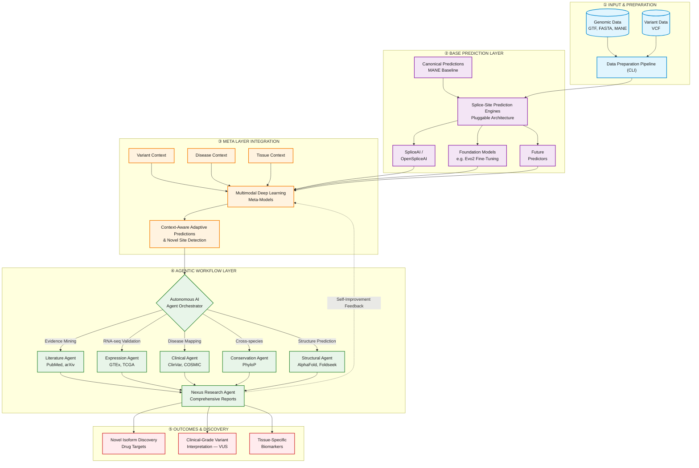

# Agentic-SpliceAI

**Context-Aware Novel Isoform Discovery for Drug Target Identification**

**Agentic-SpliceAI** is an **agentic AI system with hierarchical multi-task prediction** for discovering novel RNA isoforms — disease-specific, variant-induced, and tissue-specific splice variants that go beyond canonical annotations. Originally refactored from [Meta-SpliceAI](https://github.com/pleiadian53/meta-spliceai), it has evolved into a self-sustained **compound AI system** with extensible foundation model predictors, multimodal evidence fusion, agentic AI validation, and a meta-learning framework (M1-M4) targeting progressively harder splice prediction problems.

The system combines three key architectural ideas:
- **Multi-task learning**: Shared multimodal representation (10 modalities, 116 features) with task-specific model heads (M1-M4)
- **Hierarchical prediction**: M1 (canonical) → M2 (alternative) → M3 (novel discovery) → M4 (perturbation-induced) — each level tackles a harder problem with different label regimes
- **Agentic validation**: LLM-powered agents for literature mining, expression evidence, clinical interpretation, and recursive self-improvement

### Workflow: Prediction to Discovery

<p align="center">
  
</p>

<p align="center"><em>Conceptual workflow schematic — generated by Google Nano Banana 2</em></p>

<details>
<summary><strong>Precise workflow diagram (Mermaid)</strong></summary>


```mermaid
graph TD
    %% Color scheme matching the 5-layer workflow bands
    classDef input fill:#e1f5fe,stroke:#0288d1,stroke-width:2px,color:#1a1a1a
    classDef base fill:#f3e5f5,stroke:#8e24aa,stroke-width:2px,color:#1a1a1a
    classDef meta fill:#fff3e0,stroke:#f57c00,stroke-width:2px,color:#1a1a1a
    classDef agents fill:#e8f5e9,stroke:#388e3c,stroke-width:2px,color:#1a1a1a
    classDef output fill:#ffebee,stroke:#d32f2f,stroke-width:2px,color:#1a1a1a

    %% Layer 1: Input & Preparation
    subgraph L1 ["① INPUT & PREPARATION"]
        direction LR
        A1[(Genomic Data<br/>GTF, FASTA, MANE)]:::input
        A2[(Variant Data<br/>VCF)]:::input
        B["Data Preparation Pipeline (CLI)"]:::input
        A1 --> B
        A2 --> B
    end

    %% Layer 2: Base Prediction Layer
    subgraph L2 ["② BASE PREDICTION LAYER"]
        direction LR
        C[Canonical Predictions<br/>MANE Baseline]:::base
        D[Splice-Site Prediction Engines<br/>Pluggable Architecture]:::base
        D1[SpliceAI /<br/>OpenSpliceAI]:::base
        D2[Foundation Models<br/>e.g. Evo2 Fine-Tuning]:::base
        D3[Future<br/>Predictors]:::base
        C --> D
        D --> D1
        D --> D2
        D --> D3
    end

    %% Layer 3: Meta Layer Integration
    subgraph L3 ["③ META LAYER INTEGRATION"]
        direction LR
        E1[Variant Context]:::meta
        E2[Disease Context]:::meta
        E3[Tissue Context]:::meta
        F[Multimodal Deep Learning<br/>Meta-Models]:::meta
        G[Context-Aware Adaptive Predictions<br/>& Novel Site Detection]:::meta
        E1 --> F
        E2 --> F
        E3 --> F
        F --> G
    end

    %% Layer 4: Agentic Workflow Layer
    subgraph L4 ["④ AGENTIC WORKFLOW LAYER"]
        direction LR
        H{Autonomous AI<br/>Agent Orchestrator}:::agents
        I[Literature Agent<br/>PubMed, arXiv]:::agents
        J[Expression Agent<br/>GTEx, TCGA]:::agents
        K[Clinical Agent<br/>ClinVar, COSMIC]:::agents
        L[Conservation Agent<br/>PhyloP]:::agents
        M[Structural Agent<br/>AlphaFold, Foldseek]:::agents
        H -->|Evidence Mining| I
        H -->|RNA-seq Validation| J
        H -->|Disease Mapping| K
        H -->|Cross-species| L
        H -->|Structure Prediction| M
        I --> S
        J --> S
        K --> S
        L --> S
        M --> S
        S[Nexus Research Agent<br/>Comprehensive Reports]:::agents
    end

    %% Layer 5: Outcomes & Discovery
    subgraph L5 ["⑤ OUTCOMES & DISCOVERY"]
        direction LR
        N1[Novel Isoform Discovery<br/>Drug Targets]:::output
        N2[Clinical-Grade Variant<br/>Interpretation — VUS]:::output
        N3[Tissue-Specific<br/>Biomarkers]:::output
    end

    %% Inter-layer flow
    B --> D
    D1 --> F
    D2 --> F
    D3 --> F
    G --> H

    %% Self-improvement feedback loop
    S -.->|Self-Improvement Feedback| F

    %% Workflow to outcomes
    S --> N1
    S --> N2
    S --> N3
```

</details>

---

## 🎯 Vision: From Splice Prediction to Drug Discovery

### The Ultimate Goal: Novel Isoform Discovery

**The Challenge**: Current gene annotations (MANE, RefSeq) only capture ~10% of biologically active splice sites. The remaining **90% includes**:
- 🦠 **Disease-specific isoforms** (cancer, neurological, cardiac)
- 🧬 **Variant-induced splicing** (pathogenic mutations, VUS)
- 🧪 **Tissue-specific isoforms** (brain, immune, developmental)
- 💊 **Druggable novel targets** (oncogenes, splice modulators)

**Our Solution**: **Context-aware adaptive prediction** through multimodal meta-learning discovers novel isoforms:


```mermaid
%%{init: {'theme':'base', 'themeVariables': { 'primaryColor':'#1e3a8a','primaryTextColor':'#fff','lineColor':'#3b82f6','fontSize':'15px','fontFamily':'ui-sans-serif, system-ui, sans-serif'}}}%%

graph LR
    A["<b>📊 Annotations</b><br/>MANE/RefSeq<br/><i>~10% of sites</i>"]:::canonical
    B["<b>🧬 Base Layer</b><br/>SpliceAI • OpenSpliceAI<br/>Evo2 • SpliceBERT"]:::foundation
    C["<b>🎯 Meta Layer</b><br/>10-Modality Fusion<br/>M1-M4 Models"]:::metalayer
    D["<b>🔍 Discovery</b><br/>Delta Scoring<br/>Isoform Assembly"]:::discovery
    E["<b>🤖 Agentic Layer</b><br/>Literature • RNA-seq<br/>Clinical Validation"]:::agentic
    F["<b>💊 Novel Isoform<br/>Catalog</b><br/>Drug Targets<br/>Precision Medicine"]:::output

    A --> B --> C --> D --> E --> F

    classDef canonical fill:#1e3a8a,stroke:#1e40af,stroke-width:2px,color:#ffffff
    classDef foundation fill:#0891b2,stroke:#0e7490,stroke-width:2px,color:#ffffff
    classDef metalayer fill:#7c3aed,stroke:#6d28d9,stroke-width:2px,color:#ffffff
    classDef discovery fill:#059669,stroke:#047857,stroke-width:2px,color:#ffffff
    classDef agentic fill:#dc2626,stroke:#b91c1c,stroke-width:2px,color:#ffffff
    classDef output fill:#d97706,stroke:#b45309,stroke-width:3px,color:#ffffff
```

**Key Innovation**: The **Foundation-Adaptor Framework** uses multimodal deep learning to refine foundation model predictions with context, discovering the 90% of splice sites beyond canonical annotations!

### Why This Matters for Drug Discovery

**Traditional Approach**:
- Target canonical proteins
- Miss disease-specific isoforms
- Limited therapeutic options

**Agentic-SpliceAI Approach**:
- Discover disease-specific isoforms
- Identify druggable splice variants
- Enable isoform-selective therapeutics
- **Expand druggable genome by 10-100x**

---

## 🚀 The Agentic-SpliceAI Advantage

### 1. Pluggable Base Layer
**Model-agnostic splice prediction**: any predictor can plug into the
base layer — classical (SpliceAI, OpenSpliceAI), foundation-model-derived
(SpliceBERT + trained classifier head), or future models — as long as
its output satisfies the **per-nucleotide 3-class scoring protocol**
(neither / acceptor / donor).
- `BasePredictor` protocol + plugin registry: decorator for built-ins, YAML manifest for external/foundation-model-derived predictors
- Same CLI (`agentic-spliceai-base`), same downstream consumers — swapping a predictor is a registration concern, not an integration one
- Three predictors currently registered; the set is open-ended. Adding a new predictor requires no changes to meta layer, variant analysis, or any other downstream application
- See [`src/agentic_spliceai/applications/base_layer/protocol.py`](src/agentic_spliceai/applications/base_layer/protocol.py) for the protocol and [`examples/foundation_models/`](examples/foundation_models/) for prototype trainers (SpliceBERT, Evo2)

### 2. Adaptive Meta-Learning (Foundation-Adaptor Framework)
**Multimodal deep learning**: Refine predictions using context-aware meta-models
- **Foundation**: Base model predictions (canonical knowledge)
- **Adaptor**: Multimodal feature fusion (base scores, conservation, epigenetic marks, chromatin accessibility, RNA-seq junction evidence, RBP eCLIP binding, DNA sequence, genomic context, gene annotations) — see [Feature Catalog](docs/multimodal_feature_engineering/feature_catalog.md) and [`examples/features/`](examples/features/)
- **Context embedding**: Patient variants, disease state, tissue type
- **Self-improvement**: Learn from validation feedback continuously

### 3. Context-Aware Prediction
**Beyond static annotations**: Discover isoforms specific to:
- Patient genetic backgrounds (variant-induced splicing)
- Disease states (cancer, neurological, cardiac)
- Tissue/cell types (brain, immune, developmental)
- Environmental conditions (stress, treatment response)

### 4. Autonomous Validation
**Agentic AI workflows**:
- 🔬 **Validate** with literature, RNA-seq, and clinical databases
- 📚 **Research** biological context and functional impact
- 🧠 **Synthesize** evidence from multiple sources
- 🔄 **Iterate** through multi-agent pipelines

---

**See**:
- [Applications](docs/applications/README.md) — public ledger of matured application bundles (maturity dashboard, driving examples, evaluation)
- [Use Cases — From Discovery to Therapeutics](docs/applications/use_cases.md) — translational pathway, clinical scenarios, drug discovery impact

---

## 🎯 Key Features

### 🧬 Base Layer — Pluggable Splice Prediction

| Component | Description |
|-----------|-------------|
| **`BasePredictor` Protocol** | Single contract that makes the base layer model-agnostic: per-nucleotide 3-class scores (neither / acceptor / donor) aligned to genomic positions. Any predictor satisfying this protocol can be registered and served. |
| **Plugin Registry** | Decorator-based in-process registration for built-ins + YAML manifest (`configs/predictors.yaml`) for foundation-model-derived checkpoints and external models. Adding a predictor requires no downstream code changes. |
| **Classical Models** | SpliceAI (TF, GRCh37/Ensembl), OpenSpliceAI (PyTorch, GRCh38/MANE) — wrapped as thin adapters over the existing `BaseModelRunner`. |
| **Foundation-Model-Derived Predictors** | SpliceBERT + dilated-CNN classifier head (trained via [`examples/foundation_models/07a`](examples/foundation_models/07a_direct_shard_splice_predictor.py)) registered in the same catalog as classical models. Frozen-head and end-to-end fine-tuning pipelines for SpliceBERT, Evo2, HyenaDNA under [`foundation_models/`](foundation_models/). |
| **10-Modality Feature Fusion** | 116 features across base scores, conservation, epigenetics, chromatin accessibility (ATAC-seq + DNase-seq), junction reads, RBP binding, DNA sequence, genomic context, annotations, and optional foundation model embeddings (Evo2, SpliceBERT) — see [Feature Catalog](docs/multimodal_feature_engineering/feature_catalog.md) |
| **YAML-Driven Configs** | 4 profiles (default, full_stack, isoform_discovery, meta_m3_novel) — add/drop modalities per modeling objective |

### 🧠 Meta Layer — Context-Aware Adaptive Prediction

| Component | Description |
|-----------|-------------|
| **M1-M4 Model Variants** | Four progressively harder tasks: canonical (M1-S), alternative (M2-S), novel discovery (M3-S), perturbation-induced (M4-S) — see [Model Variants](docs/meta_layer/methods/00_model_variants_m1_m4.md) and [Naming Convention](docs/meta_layer/methods/naming_convention.md) |
| **Position-Level (M*-P)** | XGBoost baseline with Tree SHAP (M1-P: 99.74% accuracy, PR-AUC 0.999, FN -62% / FP -68% vs base-only) |
| **Sequence-Level (M*-S)** | 2-stream dilated CNN (367K params) with logit-space residual blend and per-class learned temperature (M1-S: 99.99% accuracy, PR-AUC 0.9954, FPs -15.5% vs base) — same I/O protocol as base models |
| **M2 Series** | Alternative splice site detection — Eval-Ensembl-Alt shows M2-S achieves PR-AUC 0.965 on alternative sites (base: 0.749) — see [M2 Formulations](docs/meta_layer/methods/05_m2_variant_formulations.md) and [Naming Convention](docs/meta_layer/methods/naming_convention.md) |
| **Variant Effect (M4)** | Per-variant delta scoring with splice consequence prediction — validated on 13 disease-gene variants, cryptic site positions match RNA-seq within 2bp — see [`examples/variant_analysis/`](examples/variant_analysis/) |
| **Smart Checkpointing** | Per-chromosome parquet saves, disk-backed gene cache, HDF5 shard packing, `--resume` support |

### 🤖 NEW: Agentic Workflow Enhancements

| Feature | Description |
|---------|-------------|
| **Literature Validation Agent** | Cross-reference predictions with PubMed, arXiv, and splicing databases |
| **Expression Evidence Agent** | Query GTEx, ENCODE, and tissue-specific expression data |
| **Clinical Annotation Agent** | Check ClinVar, SpliceVarDB, and disease associations |
| **Research Report Generator** | Comprehensive PDF reports with citations and biological context |
| **Self-Improving Pipeline** | Learn from validation feedback to refine predictions |

### 📊 Splice Analysis Tools

- **🧬 Domain-Specific Analysis** - Predefined templates for common splice site analyses
- **🤖 AI-Powered Insights** - LLM-generated visualizations with biological context
- **📊 Publication-Ready Charts** - High-quality plots using matplotlib/seaborn
- **🔬 Exploratory Research** - Ask custom questions about your splice site data
- **🚀 REST API** - FastAPI service for integration with other tools

### 📚 Nexus Research Agent

- **Literature Search** - Automated research on splicing mechanisms
- **Research Reports** - Comprehensive reports with LaTeX equations and citations
- **Multi-Source Integration** - arXiv, PubMed, Europe PMC, Wikipedia
- **Publication-Quality Output** - PDF generation with proper formatting
- **Iterative Refinement** - Multi-agent pipeline (Planner → Researcher → Writer → Editor)

---

## 🏗️ Architecture

| Layer | Purpose | Output | Status |
|-------|---------|--------|--------|
| **Base Layer** | Canonical splice prediction (MANE) | Baseline scores for ~10% of sites | ✅ Complete |
| **Feature Engineering** | Multimodal evidence fusion | 116 feature columns (10 modalities) | ✅ Complete |
| **Foundation Models** | Evo2/SpliceBERT classification | Per-nucleotide embeddings | 🔬 Experimental |
| **Meta Layer** | Context-aware prediction (M1-M4) | Novel sites (90% beyond MANE) | 🔄 Active |
| **Agentic Layer** | Multi-source validation + reports | Validated isoforms + drug targets | 📋 Planned |

**See**: [Architecture — Multi-Layer Pipeline](docs/architecture/README.md) for the full diagram, directory structure, and delta score analysis

---

## 🚀 Quick Start

### Bioinformatics Lab UI

Interactive web tools for splice site analysis:

```bash
# Start the Bioinformatics Lab (port 8005)
mamba run -n agentic-spliceai python -m server.bio.app
# Browse: http://localhost:8005/
```

**Pages**: Gene Browser (`/`) | Genome View (`/genome/{gene}`) | Metrics Dashboard (`/metrics`)

### Splice Analysis

#### Option 1: REST API Service (Recommended)

**Start the service:**

```bash
# Splice prediction API (port 8004)
agentic-spliceai-server

# Or run directly:
mamba run -n agentic-spliceai python -m server.splice_service.splice_service
```

**Access the API:**
- Swagger UI: http://localhost:8004/docs
- API Root: http://localhost:8004

**Example API call:**

```bash
curl -X POST http://localhost:8004/analyze/template \
  -H "Content-Type: application/json" \
  -d '{
    "dataset_path": "data/splice_sites_enhanced.tsv",
    "analysis_type": "high_alternative_splicing",
    "model": "gpt-4o-mini"
  }'
```

#### Option 2: Python Library

```python
from agentic_spliceai import create_dataset
from agentic_spliceai.splice_analysis import generate_analysis_insight
from openai import OpenAI

# Load dataset
dataset = create_dataset("data/splice_sites_enhanced.tsv")

# Generate analysis
client = OpenAI()
result = generate_analysis_insight(
    dataset=dataset,
    analysis_type="high_alternative_splicing",
    client=client,
    model="gpt-4o-mini"
)

# Save and execute code
with open("analysis.py", "w") as f:
    f.write(result["chart_code"])

# Execute to generate chart
exec(result["chart_code"])
```

### Nexus Research Agent

Generate comprehensive research reports on splicing topics:

```bash
# Generate research report on splicing mechanisms
nexus "Alternative Splicing Mechanisms in Cancer" --pdf

# Research specific splicing topics
nexus "SpliceAI Deep Learning Architecture" \
  --model openai:gpt-4o \
  --length comprehensive

# Quick literature review
nexus "Recent advances in splice site prediction" \
  --model openai:gpt-4o-mini \
  --length brief
```

**Python API:**

```python
from nexus.agents.research import ResearchAgent
from nexus.core.config import Config

# Initialize research agent
config = Config()
agent = ResearchAgent(config)

# Generate research report
result = agent.research(
    topic="Splice Site Recognition by U1 snRNP",
    length="standard",
    generate_pdf=True
)

print(f"Report saved to: {result['output_path']}")
```

**Use Cases:**
- Research latest splicing mechanisms before analysis
- Generate literature reviews for grant proposals
- Stay updated on splice prediction methods
- Validate analysis approaches with current research
- Generate comprehensive background sections

### Foundation Model Experiments

Explore foundation model embeddings for splice site prediction (experimental sub-project):

```bash
# Check hardware feasibility
python examples/foundation_models/01_resource_check.py

# Run full pipeline with synthetic data (no GPU needed, <30s)
python examples/foundation_models/02_synthetic_training_pipeline.py

# Orchestrate real pipeline (dry-run first)
python examples/foundation_models/05_run_pipeline.py --dry-run
python examples/foundation_models/05_run_pipeline.py --local-only  # synthetic data
python examples/foundation_models/05_run_pipeline.py --execute      # real GPU (costs $)
```

**Cloud deployment** (SkyPilot + RunPod):

```bash
# Extract Evo2 embeddings on A40 GPU
sky launch foundation_models/configs/skypilot/extract_embeddings_a40.yaml

# Train exon classifier
sky launch foundation_models/configs/skypilot/train_classifier_a40.yaml
```

**Hardware requirements:**

| Task | M1 Mac (16GB) | A40 (48GB) | A100 (80GB) |
|------|---------------|------------|-------------|
| Evo2 7B embeddings | ~100 bp/s (INT8) | ~10K bp/s | ~10K bp/s |
| Classifier training | CPU only | Full precision | Full precision |
| Evo2 40B | Not feasible | Tight | Comfortable |

**See**: [`foundation_models/README.md`](foundation_models/README.md) for detailed setup

### Splice Site Prediction

Predict splice sites using state-of-the-art models:

```bash
# CLI: Predict for genes
agentic-spliceai-predict --genes BRCA1 TP53 UNC13A

# CLI: Predict for chromosome
agentic-spliceai-predict --chromosomes 21 --base-model openspliceai
```

**Python API:**

```python
from agentic_spliceai.splice_engine import predict_splice_sites

# Simple prediction
results = predict_splice_sites(genes=["BRCA1", "TP53"])
positions = results["positions"]

# High-confidence predictions
import polars as pl
high_conf = positions.filter(pl.col("donor_score") > 0.9)
```

**Use Cases:**
- Predict splice sites for genes of interest
- Genome-wide splice site analysis
- Validate predictions against annotations
- Generate training data for meta-models

**See**: [Splice Prediction Guide](docs/tutorials/SPLICE_PREDICTION_GUIDE.md) for complete documentation

## 📦 Installation

### Prerequisites

```bash
# Python 3.12 (requires >= 3.11)
python --version

# Create environment for agentic-spliceai
mamba env create -f environment.yml
mamba activate agentic-spliceai
```

### Install Dependencies

```bash
# Install package in development mode
cd agentic-spliceai
pip install -e ".[dev]"
```

> **Note**: This project is designed to run independently with its own environment and dependencies.

### Set Up Environment

```bash
# Copy environment template
cp .env.example .env

# Edit .env and add your OpenAI API key
# OPENAI_API_KEY=sk-...
```

**See**: [Architecture](docs/architecture/README.md) for full directory structure; [API Endpoints](docs/api/ENDPOINTS.md) for REST API reference, configuration, and data format

## 🎓 Learning Resources

### Documentation
- [Splice Prediction Guide](docs/tutorials/SPLICE_PREDICTION_GUIDE.md) - Complete prediction walkthrough
- [Meta Layer Methods](docs/meta_layer/methods/) - Model variants (M1-M4), label hierarchy, annotation-driven prediction
- [Base Layer Architecture](docs/base_layer/) - Architecture, coordinates, data preparation
- [System Design](docs/system_design/) - Architectural design documents

### Examples (Progressive Learning Paths)

**Base Layer** (`examples/base_layer/`) — 5 scripts:
1. Single gene prediction → 2. Chromosome prediction → 3. Evaluation → 4. Chunked workflows → 5. Genome precomputation

**Feature Engineering** (`examples/features/`) — 4 scripts:
1. Base score features (43 columns) → 2. Multi-modal (annotation + genomic) → 3. Configurable modalities → 4. Genome-scale workflow

**Foundation Models** (`examples/foundation_models/`) — 5 scripts:
1. Hardware feasibility check → 2. Synthetic pipeline (no GPU) → 3. Evo2 embedding extraction → 4. Classifier training → 5. End-to-end orchestrator

**Data Preparation** (`examples/data_preparation/`) — Ground truth generation, data validation

### Related Projects
- [Meta-SpliceAI](https://github.com/pleiadian53/meta-spliceai) - Original research implementation with base and meta layers
- [Agentic AI Lab](https://github.com/pleiadian53/agentic-ai-lab) - Nexus Research Agent and agentic workflows

## 🤝 Contributing

Splice Agent is designed to be extensible. Contributions welcome!

**Add new analysis templates:**
1. Add template to `splice_analysis.py::ANALYSIS_TEMPLATES`
2. Include SQL query, chart prompt, and biological context
3. Test with sample data
4. Submit PR

**Add new data sources:**
1. Implement `ChartDataset` interface in `data_access.py`
2. Add format detection logic
3. Test with real data
4. Submit PR

## 📄 License

MIT License - see LICENSE file for details

## 🙏 Acknowledgments

- Originally refactored from [Meta-SpliceAI](https://github.com/pleiadian53/meta-spliceai)
- Nexus Research Agent from [Agentic AI Lab](https://github.com/pleiadian53/agentic-ai-lab)
- Foundation models: [Evo2](https://github.com/ArcInstitute/evo2) (Arc Institute), [SpliceAI](https://github.com/Illumina/SpliceAI) (Illumina), [OpenSpliceAI](https://github.com/Kuocheng-Liao/OpenSpliceAI)
- LLM-powered workflows via OpenAI and Anthropic APIs
- Inspired by genomics research community

## 📞 Support

- **Issues**: GitHub Issues
- **Discussions**: GitHub Discussions
- **Email**: barnettchiu@gmail.com

## 🚀 Roadmap

| Phase | Description | Status |
|-------|-------------|--------|
| 1-3 | Base Layer + Data Prep + Workflows | ✅ Complete |
| 2.5 | Bioinformatics Lab UI | ✅ Complete |
| 4 | Feature Engineering (10 modalities, 116 columns) | ✅ Complete |
| 5 | Foundation Models (Evo2, SpliceBERT) | 🔬 Experimental |
| 6 | Meta Layer — M1-S (PR-AUC 0.9954), M2-S trained (PR-AUC 0.965 alt sites) | 🔄 Active |
| 7 | Agentic Validation Layer | 📋 Planned |
| 8 | Variant Analysis — Phase 1A+1B done, ClinVar + saturation scan next | 🔄 Active |
| 9 | Isoform Discovery | 🎯 Ultimate Goal |

**See**:
- [Full Roadmap](docs/ROADMAP.md) — detailed phase breakdowns, deliverables, success metrics
- [Application Ledger](docs/applications/README.md) — maturity-tracked view of what currently runs (complements the phase-level roadmap)

---

**Ready to analyze splice sites?** Start with the [Quick Start](#-quick-start) guide or explore the [documentation](docs/README.md)!
