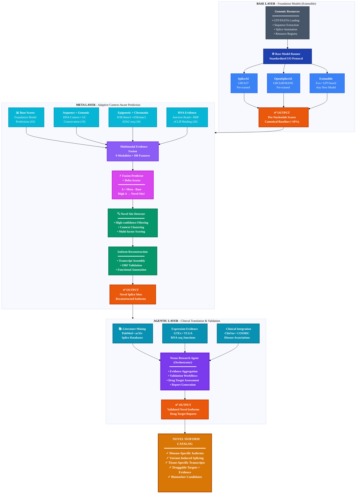

# Architecture — Multi-Layer Pipeline to Novel Isoforms

Three-layer architecture enabling progression from canonical prediction to novel isoform discovery:



---

## Layer Responsibilities

| Layer | Purpose | Output | Status |
|-------|---------|--------|--------|
| **Base Layer** | Canonical splice prediction (MANE) | Baseline scores for ~10% of sites | Done |
| **Feature Engineering** | Multimodal evidence fusion | 9-modality, 100-column enriched features | Done |
| **Foundation Models** | Evo2/SpliceBERT splice classification | Per-nucleotide embeddings + classifiers | Experimental |
| **Meta Layer** | Context-aware adaptive prediction (M1-M4) | Novel sites (90% beyond MANE) | Active |
| **Agentic Layer** | Multi-source validation + reports | Validated isoforms + drug targets | Planned |

---

## Feature Engineering

The multimodal pipeline fuses 9 data modalities into 100 feature columns per genomic position via a YAML-driven workflow:

| Modality | Columns | Source |
|----------|---------|--------|
| base_scores | 43 | Foundation model predictions (SpliceAI/OpenSpliceAI) |
| annotation | 3 | Ground truth splice labels |
| sequence | 3 | DNA context via pyfaidx |
| genomic | 4 | GC content, CpG density, dinucleotides |
| conservation | 9 | PhyloP/PhastCons (UCSC bigWig) |
| epigenetic | 12 | H3K36me3/H3K4me3 ChIP-seq (ENCODE) |
| junction | 12 | GTEx RNA-seq junction evidence |
| rbp_eclip | 8 | ENCODE RBP eCLIP binding peaks |
| chrom_access | 6 | ENCODE ATAC-seq chromatin accessibility |

See [`docs/multimodal_feature_engineering/feature_catalog.md`](../multimodal_feature_engineering/feature_catalog.md) for the complete feature reference and [`examples/features/docs/`](../../examples/features/docs/) for per-modality tutorials.

---

## Delta Score Analysis

The key innovation for novel isoform discovery is the delta score -- the difference between meta layer and base layer predictions:

```python
delta_score = meta_prediction - base_prediction

if delta_score > 0.3:  # High confidence
    # This splice site is context-dependent!
    # -> Novel isoform candidate
    # -> Not in MANE canonical set
    # -> Validate with RNA-seq, literature, conservation
```

- **Base layer** (SpliceAI/OpenSpliceAI): Trained on canonical annotations, detects ~10% of sites
- **Meta layer** (Context-aware): Learns from variants, disease, tissue context, detects the other 90%
- **Delta score** = Confidence that this is a real novel isoform, not noise

---

## Project Structure

```text
agentic-spliceai/
├── src/
│   ├── agentic_spliceai/
│   │   │
│   │   ├── splice_engine/           # Core splice prediction engine
│   │   │   │
│   │   │   ├── config/              # Configuration management
│   │   │   │   ├── genomic_config.py    # Config dataclass & loader
│   │   │   │   └── settings.yaml        # Default settings
│   │   │   │
│   │   │   ├── resources/           # Genomic resource management
│   │   │   │   ├── registry.py          # Path resolution for GTF/FASTA/models
│   │   │   │   └── schema.py            # Column standardization (splice_type, chrom)
│   │   │   │
│   │   │   ├── utils/               # Shared utilities
│   │   │   │   ├── dataframe.py         # DataFrame operations
│   │   │   │   ├── display.py           # Printing & formatting
│   │   │   │   └── filesystem.py        # File I/O helpers
│   │   │   │
│   │   │   ├── base_layer/          # Base model predictions
│   │   │   │   ├── models/              # Model configs + runner
│   │   │   │   │   ├── config.py            # BaseModelConfig, WorkflowConfig
│   │   │   │   │   └── runner.py            # BaseModelRunner
│   │   │   │   ├── prediction/          # Core prediction logic
│   │   │   │   ├── workflows/           # Chunked prediction pipeline
│   │   │   │   │   └── prediction.py        # PredictionWorkflow (checkpointing, resume)
│   │   │   │   ├── io/                  # Artifact management
│   │   │   │   │   └── artifacts.py         # ArtifactManager (atomic writes, mode-aware)
│   │   │   │   └── data/                # Data types & preparation
│   │   │   │
│   │   │   ├── features/            # Multimodal feature engineering
│   │   │   │   ├── pipeline.py          # FeaturePipeline (dependency resolution)
│   │   │   │   ├── workflow.py          # FeatureWorkflow (genome-scale)
│   │   │   │   ├── modality.py          # Modality protocol (ABC)
│   │   │   │   ├── verification.py      # Position alignment verification
│   │   │   │   └── modalities/          # 9 modalities:
│   │   │   │       ├── base_scores.py       # 43 engineered features
│   │   │   │       ├── annotation.py        # Ground truth labels (3)
│   │   │   │       ├── sequence.py          # DNA context via pyfaidx (3)
│   │   │   │       ├── genomic.py           # GC content, CpG, dinucs (4)
│   │   │   │       ├── conservation.py      # PhyloP/PhastCons bigWig (9)
│   │   │   │       ├── epigenetic.py        # H3K36me3/H3K4me3 ChIP-seq (12)
│   │   │   │       ├── junction.py          # GTEx RNA-seq junctions (12)
│   │   │   │       ├── rbp_eclip.py         # ENCODE RBP eCLIP binding (8)
│   │   │   │       └── chrom_access.py      # ENCODE ATAC-seq accessibility (6)
│   │   │   │
│   │   │   ├── eval/                # Cross-layer evaluation
│   │   │   │   ├── metrics.py           # TP/FP/FN, sensitivity, specificity
│   │   │   │   ├── output.py            # EvaluationOutputWriter
│   │   │   │   └── display.py           # Result visualization
│   │   │   │
│   │   │   ├── data/                # Cross-layer data utilities
│   │   │   │   └── sampling.py          # Balanced train/test sampling
│   │   │   │
│   │   │   ├── meta_layer/          # Meta-learning layer
│   │   │   │   ├── core/                # Configuration & schema
│   │   │   │   │   ├── config.py            # MetaLayerConfig
│   │   │   │   │   └── feature_schema.py    # Feature definitions (8 column groups)
│   │   │   │   ├── models/              # Neural network models
│   │   │   │   ├── training/            # Training pipeline
│   │   │   │   └── workflows/           # Meta-layer workflows
│   │   │   │
│   │   │   └── cli/                 # CLI entry points
│   │   │       ├── predict.py           # agentic-spliceai-predict
│   │   │       └── prepare.py           # agentic-spliceai-prepare
│   │   │
│   │   ├── agents/                  # Agentic workflows (WIP)
│   │   ├── server/                  # FastAPI splice service
│   │   └── analysis/                # Analysis tools & templates
│   │
│   └── nexus/                       # Research agent package
│       ├── agents/                      # Multi-agent pipeline
│       │   ├── research/                    # Research orchestrator
│       │   ├── planner/                     # Research planning
│       │   ├── researcher/                  # Information gathering
│       │   ├── writer/                      # Report writing
│       │   └── editor/                      # Report refinement
│       ├── core/                        # Core utilities
│       ├── cli/                         # CLI interface
│       └── templates/                   # Report templates
│
├── foundation_models/               # Experimental sub-project (own pyproject.toml)
│   ├── foundation_models/
│   │   ├── evo2/                        # Evo2-based exon classifier
│   │   │   ├── config.py                    # Evo2Config (device auto-detect)
│   │   │   ├── model.py                     # HuggingFace wrapper
│   │   │   ├── embedder.py                  # Chunked extraction + HDF5 cache
│   │   │   └── classifier.py               # ExonClassifier (linear/MLP/CNN/LSTM)
│   │   └── utils/                       # Quantization, chunking
│   ├── configs/skypilot/               # SkyPilot cloud deployment (RunPod)
│   ├── examples/                        # Learning path (01-05)
│   └── docs/                            # Sub-project documentation
│
├── server/                          # Standalone FastAPI services
│   ├── bio/                             # Bioinformatics Lab UI (port 8005)
│   │   ├── app.py                           # FastAPI + Jinja2 entry point
│   │   ├── bio_service.py                   # Core service (LRU cache, predictions)
│   │   └── templates/                       # HTML templates (Gene Browser, etc.)
│   ├── splice_service/                  # Splice prediction API (port 8004)
│   └── chart_service/                   # Chart/viz API (port 8003)
│
├── examples/                        # Learning path examples
│   ├── base_layer/                      # 5 scripts: prediction -> precomputation
│   ├── features/                        # 4 scripts: base scores -> genome-scale
│   ├── foundation_models/               # 5 scripts: resource check -> orchestrate
│   └── data_preparation/               # Data prep & ground truth generation
│
├── data/                            # Data directory (symlinked)
│   ├── ensembl/GRCh37/                  # Ensembl annotations
│   ├── mane/GRCh38/                     # MANE annotations
│   └── models/                          # Pre-trained model weights
│
├── notebooks/                       # Jupyter analysis & demos
├── docs/                            # Public documentation (MkDocs)
├── scripts/                         # Utility scripts
├── tests/                           # Unit tests
└── pyproject.toml                   # Package configuration
```

---

## Related Documentation

- [Package Organization](PACKAGE_ORGANIZATION.md) -- How the codebase is structured
- [Structure Guide](STRUCTURE.md) -- Directory structure overview
- [Processing Architecture](../base_layer/PROCESSING_ARCHITECTURE.md) -- Base layer architecture
- [Configuration System](../system_design/configuration_system.md) -- Pydantic-based configuration patterns

---

Last Updated: March 2026
