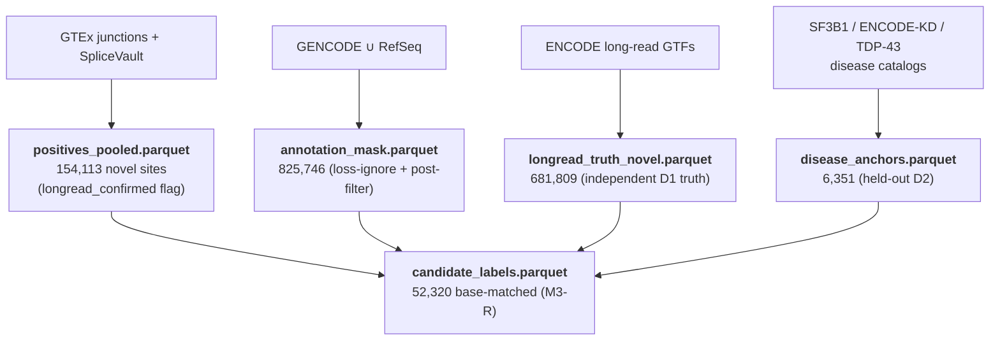

# Stage 9 — M3 Label Curation (Novel-Site Sub-Series)

**Pipeline position:** `feature engineering (Stage 3) → ` **M3 sub-series** ` → 10 training → 11 evaluation`

M3 (novel splice sites) reuses Stages 1–3 unchanged — the same data prep, base scoring, and multimodal
feature parquets as M1-S/M2-S. What it does **not** share is its labels: a novel site has no annotation
to learn from, so M3's label set has to be *curated from evidence* (junction reads, long-read isoforms,
disease catalogs). This stage is that curation. It is pure data engineering — no model, no GPU — and it
produces every parquet the M3 recognizer and refiner consume.

!!! abstract "Inputs → Outputs"
    **Reads:** GTEx junctions, SpliceVault, disease catalogs, ENCODE long-read GTFs, the annotation union.
    **Writes:** the label pools under `data/mane/GRCh38/m3_labels/` and the D1 truth under
    `data/encode_longread/GRCh38/`.

The *why* behind each choice — recognizer + post-filter, junction-as-label, base-matched negatives — is
[06_m3_novel_site_formulation.md](../../meta_layer/methods/06_m3_novel_site_formulation.md). This doc is
the *how* and *in what order*.

---

## What gets built



| Output | Built by | Role |
|--------|----------|------|
| `positives_pooled.parquet` | `03_ingest_splicevault.py` → `04_merge_positives.py` | recognizer positives (donor/acceptor) |
| `disease_anchors.parquet` | `05`/`06`/`07_ingest_*` → `08_finalize_anchors.py` | held-out D2 eval truth |
| `annotation_mask.parquet` | `09_build_negatives.py` (writes the mask) | loss ignore-index **and** the novelty post-filter set |
| `negatives.parquet` | `09_build_negatives.py` | recognizer decoys (largely vestigial — see methods §4) |
| `longread_truth_novel.parquet` | `10_build_longread_truth.py` | independent **D1** eval truth |
| `candidate_labels.parquet` | `11_build_candidate_labels.py` | base-score-matched real-vs-artifact table (M3-R) |

Scripts live in
[`examples/data_preparation/m3/`](https://github.com/pleiadian53/agentic-spliceai/blob/main/examples/data_preparation/m3/).

---

## Step 1 — the positive pool (novel sites)

Novel positives come almost entirely from **SpliceVault** (cryptic events observed across 335K RNA-seq
samples) plus a small **GTEx-novel** survivor set from the cross-annotation audit
(`01_cross_annotation_audit.py`, which intersects GTEx junction sides against GENCODE/RefSeq/UCSC to keep
only the genuinely-unannotated ones).

```bash
python examples/data_preparation/m3/03_ingest_splicevault.py   # SpliceVault → parquet
python examples/data_preparation/m3/04_merge_positives.py      # + GTEx-novel → positives_pooled.parquet
```

`04` also anti-joins the pool against the annotation union (so every positive is genuinely novel) and
stamps the **`longread_confirmed`** flag used later by `--confirmed-weight` / Tier 1.

## Step 2 — disease anchors (held-out D2)

TDP-43, SF3B1, and ENCODE-KD cryptic-site catalogs are ingested and finalized into a **held-out** eval
set — anti-joined out of the training positives so they never leak.

```bash
python examples/data_preparation/m3/05_ingest_sf3b1_anchors.py
python examples/data_preparation/m3/06_ingest_encode_kd_anchors.py
python examples/data_preparation/m3/07_ingest_tdp43_anchors.py
python examples/data_preparation/m3/08_finalize_anchors.py     # → disease_anchors.parquet (is_novel flag)
```

## Step 3 — the mask and the recognizer decoys

```bash
python examples/data_preparation/m3/09_build_negatives.py
```

Writes `annotation_mask.parquet` (GENCODE ∪ RefSeq-curated — the set the loss ignores *and* the
inference post-filter subtracts) and `negatives.parquet` (GT/AG decoys + easy non-sites). Note the
negatives are dinucleotide decoys with ~0 base score — fine as recognizer decoys, but **not** usable for
M3-R, which needs base-matched negatives (Step 5).

## Step 4 — the independent long-read truth (D1)

```bash
python examples/data_preparation/m3/10_build_longread_truth.py
```

Builds `longread_truth_novel.parquet` from ENCODE long-read (PacBio/ONT) transcriptome GTFs — junctions
confirmed by full-transcript reads, absent from annotation. This is the **anti-circular** eval truth:
independent of the SpliceVault short-read signal the positives came from.

## Step 5 — base-matched candidate labels (for M3-R)

```bash
python examples/data_preparation/m3/11_build_candidate_labels.py --confirmed-only --neg-ratio 3
```

Joins the peak-preserving feature parquets to the labels and samples **base-score-matched hard
negatives** — positives = confirmed novel sites in the parquets; negatives = base-proposed positions
*not* in `annotation ∪ positives ∪ D1 ∪ D2` (all eval sets excluded so no held-out truth is trained as
an artifact), stratified to the positives' base-score histogram. Output `candidate_labels.parquet`
(52,320 rows). Fully local — no bigWig, no pod.

---

## Verify

```bash
python -c "import polars as pl; d='data/mane/GRCh38/m3_labels/'; \
print('positives', pl.read_parquet(d+'positives_pooled.parquet').height); \
print('anchors',   pl.read_parquet(d+'disease_anchors.parquet').height); \
print('candidates',pl.read_parquet(d+'candidate_labels.parquet').height)"
```

Expected: 154,113 / 6,351 / 52,320. Coordinate integrity is checked by the GT/AG-by-strand oracle (all
positives sit at a canonical dinucleotide on the correct strand) — see
[`examples/meta_layer/docs/M3/m3_training_data.md`](https://github.com/pleiadian53/agentic-spliceai/blob/main/examples/meta_layer/docs/M3/m3_training_data.md).

---

→ **Next: [Stage 10 — Training M3](10_training_m3.md)**
