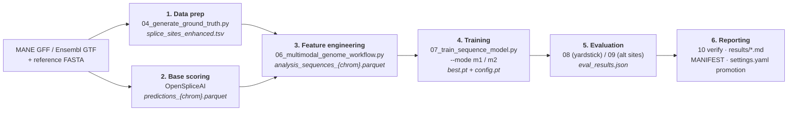

# Meta-Layer MLOps Workflow — Training & Evaluating M1-S / M2-S

This series is the **golden path** for the sequence-level meta-models: it walks the whole
pipeline end to end, from raw genome annotation (GTF/GFF + FASTA) to a promoted, evaluated
checkpoint with reported metrics. It is written around the two production models —

- **M1-S** — the *canonical* refiner (trained on MANE splice sites), and
- **M2-S** — the *alternative-site* refiner (trained on Ensembl splice sites),

— because they are the two that are fully trained, promoted, and in use. **M3 (novel sites)** reuses
Stages 1–3 and then branches into its own **sub-series ([Stages 9–11](09_m3_label_curation.md))** —
novel-site labels are curated from *evidence* (junction reads, long-read isoforms) rather than
annotation, so M3 needs its own label curation, training, and anti-circular evaluation. M4
(perturbation-induced sites) reuses most of the same stages and is out of scope here.

!!! info "What this series is (and isn't)"
    It is the **connective tissue** between stages: which script runs, in what order, what it
    reads, what it writes, and where the artifact lands. Each stage links out to the deeper
    standalone reference (feature catalog, evaluation tutorial, architecture notes) rather than
    repeating it.

---

## The pipeline at a glance

| # | Stage | Driver script | Reads | Writes |
|---|-------|---------------|-------|--------|
| [1](01_data_preparation.md) | Data preparation (labels) | `data_preparation/04_generate_ground_truth.py` | GTF exon boundaries | `data/<source>/<build>/splice_sites_enhanced.tsv` |
| [2](02_base_scoring.md) | Base scoring | base-layer prediction / `PredictionWorkflow` | FASTA + gene windows | `…/openspliceai_eval/precomputed/predictions_{chrom}.parquet` |
| [3](03_feature_engineering.md) | Feature engineering | `features/06_multimodal_genome_workflow.py` | predictions + bigWig/junction/eCLIP | `…/openspliceai_eval/analysis_sequences/analysis_sequences_{chrom}.parquet` |
| [4](04_training_m1s.md) · [5](05_training_m2s.md) | Training | `meta_layer/07_train_sequence_model.py` | labels + base scores + dense channels | `output/meta_layer/{m1s,m2s}_v4_cleanannot/` |
| [6](06_evaluation.md) | Evaluation | `08_evaluate_sequence_model.py`, `09_evaluate_alternative_sites.py` | checkpoint + `.npz` cache | `eval_results.json`, `m2a_eval_results.json` |
| [7](07_reporting.md) | Reporting | `10_verify_evaluation_stats.py`, `results/*.md` | result JSONs | roll-ups + promotion registry |
| [8](08_gpu_pods.md) | *(optional)* GPU pods | `meta_layer/ops_*.sh` | — | same artifacts, on a RunPod GPU |
| **M3 sub-series** — reuses Stages 1–3, then: | | | | |
| [9](09_m3_label_curation.md) | *(M3)* Label curation | `data_preparation/m3/*.py` | junctions + long-read + disease catalogs | `data/mane/GRCh38/m3_labels/*.parquet` |
| [10](10_training_m3.md) | *(M3)* Training | `07 --mode m3` (pod) · `14` (local) | M3 labels + candidate table | `output/meta_layer/{m3_v1, m3r_candidate_refiner}/` |
| [11](11_m3_evaluation.md) | *(M3)* Anti-circular eval | `13_evaluate_m3_novel.py`, `15_…` | checkpoint / booster + D1/D2 truth | `m3_eval_metrics.json` |

---

## Three things to understand before you start

These are the concepts that make the rest of the series read cleanly. Skim them now.

### 1. M2-S is M1-S plus one extra label file

The two models share the base model, the feature stack, the architecture, and the training script.
They differ in exactly **one input**: the ground-truth annotation.

- **M1-S** trains on **MANE** splice sites (curated canonical set).
- **M2-S** trains on **Ensembl** splice sites, and "alternative sites" are defined as the
  **set difference Ensembl \ MANE** — the sites Ensembl annotates that MANE omits.

So the only extra data-prep step for M2-S is running the ground-truth builder a second time against
Ensembl. Everything downstream is the same script with a different `--mode`.

### 2. There are two model lines that share the feature stack

The multimodal feature stack (Stage 3) feeds **two different kinds of model**, and it is easy to
conflate them:

| Line | Example | How it consumes features |
|------|---------|--------------------------|
| **Position-level (`-P`)** | M1-P XGBoost (`01_xgboost_baseline.py`) | reads the `analysis_sequences_{chrom}.parquet` **tables directly** (one row per position) |
| **Sequence-level (`-S`)** | **M1-S / M2-S** (`07_train_sequence_model.py`) | reads the modalities as **dense per-position channels** built on the fly by `DenseFeatureExtractor`, cached per gene as `.npz` |

This series is about the **`-S` (sequence-level) line**. The parquet tables still matter to it —
they drive *which positions get sampled* and feed the foundation-model scalar step — but the model
itself trains on dense `.npz` channels, not the parquet rows. Keep this distinction in mind at
Stages 3–4.

### 3. Three independent config levers (and two confusingly-named "v4"s)

Nothing about the architecture lives in a YAML. Model identity is set by two CLI flags at training
time plus one promotion registry:

| Lever | Where | Controls |
|-------|-------|----------|
| `--mode {m1,m2,m3}` | `07_train_sequence_model.py` | **variant / label source** — `m1`=canonical/MANE, `m2`=alt/Ensembl |
| `--arch {v3,v4_xattn}` | `07_train_sequence_model.py` | **neural architecture** — `v3` (default, promoted) vs `v4_xattn` (cross-attention, WIP) |
| `meta_models:` block | `config/settings.yaml` | **promotion pointer** — which output dir is the canonical M1-S / M2-S |

!!! warning "`v4_cleanannot` is *not* the `v4_xattn` architecture"
    The promoted directories `m1s_v4_cleanannot` / `m2s_v4_cleanannot` carry a **data/experiment**
    version tag ("v4" = minus-strand-corrected clean annotation + neuronal-RBP union). The models
    inside are still **architecture v3** — `config.pt` is the v3 `MetaSpliceConfig`. Do not read the
    directory "v4" as the neural `--arch v4_xattn`. They are orthogonal axes.

---

## Prerequisites

Before Stage 1 you need the environment and the raw reference data resolvable through the registry:

- The `agentic-spliceai` conda/mamba environment (see [Setup Guide](../../SETUP.md)).
- Reference **FASTA** and the **MANE GFF** (M1-S) / **Ensembl GTF** (M2-S), placed under
  `data/<source>/<build>/` so the registry resolves them. See
  [Resource Management](../../system_design/resource_management.md) and
  [Configuration System](../../system_design/configuration_system.md).
- For the external feature modalities (Stage 3), the bigWig/junction/eCLIP sources — these are
  streamed and cached; the [Feature Engineering](03_feature_engineering.md) doc covers the cache.

Genome-scale runs (all 24 chromosomes, all 9 modalities) are GPU/compute heavy; the
[GPU Pods runbook](08_gpu_pods.md) covers running Stages 3–6 on RunPod. Every stage in this series
also runs locally on a small gene subset for learning and smoke-testing.

---

## Deeper references (linked, not repeated)

| Topic | Reference |
|-------|-----------|
| Model naming (`M{task}-{S/P}`, `Eval-*`) | [meta_layer/methods/naming_convention.md](../../meta_layer/methods/naming_convention.md) |
| Meta-model concept & motivation | [meta_layer/README.md](../../meta_layer/README.md) |
| Architecture (three-stream CNN, `[L,3]` contract) | [meta_layer/ARCHITECTURE.md](../../meta_layer/ARCHITECTURE.md) |
| Complete feature list (all modalities, every column) | [multimodal_feature_engineering/feature_catalog.md](../../multimodal_feature_engineering/feature_catalog.md) |
| Evaluation modes & flags in depth | *linked from [Stage 6](06_evaluation.md)* |

---

## Start here

→ **[Stage 1: Data Preparation](01_data_preparation.md)**
