# Base Layer Feature Set Architecture

**Purpose**: Document the complete feature set generated by the meta-spliceai base layer for meta-model training  
**Date**: November 28, 2025  
**Context**: Stage 2 - Core Workflow Analysis

---

## Overview

The base layer's primary purpose is to transform **raw base model predictions** into a **rich feature set** suitable for meta-learning. This document catalogs all features generated during the prediction workflow.

### Feature Generation Pipeline

```mermaid
graph LR
    A[Base Model<br/>SpliceAI/OpenSpliceAI] --> B[Raw Scores<br/>3 probabilities]
    B --> C[Context Extraction<br/>±2 positions]
    C --> D[Derived Features<br/>40+ features]
    D --> E[Sequence Context<br/>Genomic windows]
    E --> F[Complete Feature Set<br/>For Meta-Learning]
    
    style F fill:#ff6b6b,stroke:#333,stroke-width:4px
```



---

## Feature Categories

### 1. Raw Splice Site Scores (3 features)

**Source**: Base model output (SpliceAI, OpenSpliceAI)  
**Module**: `enhanced_evaluation.py` → `enhanced_evaluate_splice_site_errors()`

| Feature | Type | Range | Description |
|---------|------|-------|-------------|
| `donor_score` | float | [0, 1] | Probability of donor splice site at this position |
| `acceptor_score` | float | [0, 1] | Probability of acceptor splice site at this position |
| `neither_score` | float | [0, 1] | Probability of neither splice site type |

**Properties**:
- Sum to 1.0: `donor_score + acceptor_score + neither_score = 1.0`
- Per-nucleotide resolution
- Strand-aware (computed separately for + and - strands)

**Example**:
```python
position_12345: {
    'donor_score': 0.85,      # High donor probability
    'acceptor_score': 0.10,   # Low acceptor probability
    'neither_score': 0.05     # Very low neither probability
}
```

---

### 2. Context Scores (4 features)

**Source**: Neighboring positions (±2 window)  
**Module**: `enhanced_evaluation.py` → `get_context_scores()`

| Feature | Type | Range | Description |
|---------|------|-------|-------------|
| `context_score_m2` | float | [0, 1] | Score at position - 2 (2 bases upstream) |
| `context_score_m1` | float | [0, 1] | Score at position - 1 (1 base upstream) |
| `context_score_p1` | float | [0, 1] | Score at position + 1 (1 base downstream) |
| `context_score_p2` | float | [0, 1] | Score at position + 2 (2 bases downstream) |

**Purpose**:
- Capture local signal patterns
- Detect peaks vs. plateaus
- Enable derivative calculations
- Identify false positives (isolated high scores)

**Boundary Handling**:
- Zero-padding at sequence boundaries
- Symmetric padding ensures consistent feature dimensions

**Example**:
```python
# True splice site (sharp peak)
position_12345: {
    'context_score_m2': 0.05,
    'context_score_m1': 0.15,
    'donor_score': 0.85,      # Peak
    'context_score_p1': 0.12,
    'context_score_p2': 0.03
}

# False positive (plateau)
position_67890: {
    'context_score_m2': 0.45,
    'context_score_m1': 0.48,
    'donor_score': 0.52,      # Not a clear peak
    'context_score_p1': 0.47,
    'context_score_p2': 0.44
}
```

---

### 3. Basic Derived Features (7 features)

**Source**: Computed from raw scores  
**Module**: `enhanced_workflow.py` → `enhanced_process_predictions_with_all_scores()`

| Feature | Formula | Range | Description |
|---------|---------|-------|-------------|
| `relative_donor_probability` | `donor / (donor + acceptor + ε)` | [0, 1] | Donor probability relative to acceptor |
| `splice_probability` | `(donor + acceptor) / (donor + acceptor + neither + ε)` | [0, 1] | Overall splice probability |
| `donor_acceptor_diff` | `(donor - acceptor) / (max(donor, acceptor) + ε)` | [-1, 1] | Normalized difference between donor/acceptor |
| `splice_neither_diff` | `(max(donor, acceptor) - neither) / (max(all) + ε)` | [-1, 1] | Splice vs. neither difference |
| `donor_acceptor_logodds` | `log(donor + ε) - log(acceptor + ε)` | ℝ | Log-odds ratio (donor vs acceptor) |
| `splice_neither_logodds` | `log(donor + acceptor + ε) - log(neither + ε)` | ℝ | Log-odds ratio (splice vs neither) |
| `probability_entropy` | `-Σ p_i * log(p_i)` | [0, log(3)] | Uncertainty in probability distribution |

**Note**: `ε = 1e-10` (epsilon) prevents division by zero

**Interpretation**:
- **High entropy**: Uncertain prediction (probabilities similar)
- **Low entropy**: Confident prediction (one probability dominates)
- **Log-odds**: Amplifies differences, useful for classification

---

### 4. Context-Agnostic Features (3 features)

**Source**: Aggregate statistics from context window  
**Module**: `enhanced_workflow.py` → `generate_context_agnostic_features()`

| Feature | Formula | Description |
|---------|---------|-------------|
| `context_neighbor_mean` | `(m2 + m1 + p1 + p2) / 4` | Average of neighboring scores |
| `context_asymmetry` | `(m1 + m2) - (p1 + p2)` | Upstream vs downstream bias |
| `context_max` | `max(m2, m1, p1, p2)` | Maximum neighboring score |

**Use Cases**:
- **neighbor_mean**: Background signal level
- **asymmetry**: Directional bias (useful for strand-specific patterns)
- **context_max**: Nearby competing signals

---

### 5. Donor-Specific Features (~15 features)

**Source**: Donor score + context analysis  
**Module**: `enhanced_workflow.py` → `generate_donor_features()`

#### Differential Features (4)
| Feature | Formula | Description |
|---------|---------|-------------|
| `donor_diff_m1` | `donor - context_m1` | Rise from position -1 |
| `donor_diff_m2` | `donor - context_m2` | Rise from position -2 |
| `donor_diff_p1` | `donor - context_p1` | Fall to position +1 |
| `donor_diff_p2` | `donor - context_p2` | Fall to position +2 |

#### Peak Detection Features (4)
| Feature | Formula | Description |
|---------|---------|-------------|
| `donor_surge_ratio` | `donor / (context_m1 + context_p1 + ε)` | How much higher than neighbors |
| `donor_is_local_peak` | `(donor > m1) & (donor > p1) & (donor > 0.001)` | Binary peak indicator |
| `donor_weighted_context` | `0.1*m2 + 0.2*m1 + 0.4*donor + 0.2*p1 + 0.1*p2` | Weighted local average |
| `donor_peak_height_ratio` | `donor / (mean(neighbors) + ε)` | Normalized peak height |

#### Signal Analysis Features (4)
| Feature | Formula | Description |
|---------|---------|-------------|
| `donor_second_derivative` | `(donor - m1) - (p1 - donor)` | Rate of change of rate of change |
| `donor_signal_strength` | `donor - mean(neighbors)` | Signal above background |
| `donor_context_diff_ratio` | `(donor - max(neighbors)) / (donor + ε)` | Relative peak prominence |
| `donor_sharpness` | `donor / (std(neighbors) + ε)` | Peak sharpness measure |

#### Additional Features (~3 more)
- Gradient features
- Smoothness measures
- Local variance

**Total**: ~15 donor-specific features

---

### 6. Acceptor-Specific Features (~15 features)

**Source**: Acceptor score + context analysis  
**Module**: `enhanced_workflow.py` → `generate_acceptor_features()`

**Structure**: Identical to donor features, but computed for acceptor scores:
- `acceptor_diff_m1`, `acceptor_diff_m2`, `acceptor_diff_p1`, `acceptor_diff_p2`
- `acceptor_surge_ratio`, `acceptor_is_local_peak`, `acceptor_weighted_context`
- `acceptor_peak_height_ratio`, `acceptor_second_derivative`, `acceptor_signal_strength`
- ... (same structure as donor features)

**Total**: ~15 acceptor-specific features

---

### 7. Cross-Score Features (2 features)

**Source**: Relationships between donor and acceptor  
**Module**: `enhanced_workflow.py` → `generate_cross_score_features()`

| Feature | Formula | Description |
|---------|---------|-------------|
| `score_difference_ratio` | `(donor - acceptor) / (donor + acceptor + ε)` | Normalized donor/acceptor difference |
| `signal_strength_ratio` | `donor_signal_strength / (acceptor_signal_strength + ε)` | Relative signal strengths |

**Purpose**: Capture competitive relationships between splice site types

---

### 8. Positional Metadata (8+ features)

**Source**: Genomic coordinates and annotations  
**Module**: Various (workflow, evaluation)

| Feature | Type | Description |
|---------|------|-------------|
| `gene_id` | str | Gene identifier (Ensembl ID or symbol) |
| `transcript_id` | str | Transcript identifier |
| `chrom` | str | Chromosome (1-22, X, Y, MT) |
| `position` | int | Genomic position (1-based) |
| `strand` | str | Strand ('+' or '-') |
| `splice_type` | str | 'donor' or 'acceptor' (reference annotation) |
| `error_type` | str | 'TP', 'FP', 'FN', 'TN' (evaluation result) |
| `window_start` | int | Error analysis window start |
| `window_end` | int | Error analysis window end |

---

### 9. Sequence Context (Variable length)

**Source**: Genomic sequence windows  
**Module**: `sequence_data_utils.py` → `extract_analysis_sequences()`

| Feature | Type | Description |
|---------|------|-------------|
| `sequence` | str | Nucleotide sequence window around position |

**Window Sizes** (configurable):
- **Default**: ±50 bp (101 bp total)
- **Extended**: ±200 bp (401 bp total)
- **Custom**: User-defined

**Purpose**:
- Sequence motif learning
- CNN/Transformer input
- Splice site consensus analysis

**Example**:
```python
position_12345: {
    'sequence': 'ATCG...GTAG...ACGT',  # 101 bp centered on position
    'window_start': 12295,
    'window_end': 12395
}
```

---

## Complete Feature Set Summary

### Feature Count by Category

| Category | Count | Module | Essential for Porting |
|----------|-------|--------|----------------------|
| **Raw Scores** | 3 | `enhanced_evaluation.py` | ✅ Yes |
| **Context Scores** | 4 | `enhanced_evaluation.py` | ✅ Yes |
| **Basic Derived** | 7 | `enhanced_workflow.py` | ✅ Yes |
| **Context-Agnostic** | 3 | `enhanced_workflow.py` | ✅ Yes |
| **Donor-Specific** | ~15 | `enhanced_workflow.py` | ✅ Yes |
| **Acceptor-Specific** | ~15 | `enhanced_workflow.py` | ✅ Yes |
| **Cross-Score** | 2 | `enhanced_workflow.py` | ✅ Yes |
| **Positional Metadata** | 8+ | Various | ✅ Yes |
| **Sequence Context** | 1 (variable) | `sequence_data_utils.py` | ⚠️ Optional |
| **TOTAL** | **~58+ features** | | |

---

## Feature Engineering Philosophy

### Design Principles

1. **Multi-Resolution**: Capture patterns at different scales
   - Point: Raw scores
   - Local: Context window (±2)
   - Regional: Sequence windows (±50-200)

2. **Multi-Perspective**: Different mathematical views
   - Linear: Differences, ratios
   - Logarithmic: Log-odds
   - Statistical: Entropy, variance
   - Geometric: Peaks, derivatives

3. **Domain Knowledge**: Biologically-motivated features
   - Peak detection (splice sites are sharp peaks)
   - Asymmetry (directional patterns)
   - Signal-to-noise (true sites vs. background)

4. **Redundancy by Design**: Multiple correlated features
   - Allows meta-model to learn which representations work best
   - Different features may work better for different genes/contexts

---

## Feature Usage in Meta-Learning

### Training Data Structure

```python
# Each position becomes a training example
training_example = {
    # Target variable
    'error_type': 'TP',  # or 'FP', 'FN', 'TN'
    
    # Features (input to meta-model)
    'donor_score': 0.85,
    'acceptor_score': 0.10,
    'neither_score': 0.05,
    'context_score_m2': 0.05,
    'context_score_m1': 0.15,
    'context_score_p1': 0.12,
    'context_score_p2': 0.03,
    'relative_donor_probability': 0.89,
    'splice_probability': 0.95,
    'donor_surge_ratio': 5.67,
    'donor_is_local_peak': 1,
    'probability_entropy': 0.52,
    # ... ~50 more features
    
    # Metadata (for analysis, not training)
    'gene_id': 'BRCA1',
    'position': 12345,
    'chrom': '17'
}
```

### Meta-Model Objectives

**Classification Tasks**:
1. **Binary**: True splice site (TP) vs. False positive (FP)
2. **Multi-class**: TP vs. FP vs. FN vs. TN
3. **Confidence**: Probability of correct prediction

**Regression Tasks**:
1. **Score Calibration**: Adjust raw scores for better accuracy
2. **Position Refinement**: Predict offset from true position

---

## Implementation Notes

### Memory Considerations

**Per Position**: ~58 features × 8 bytes (float64) = **464 bytes**

**Full Genome** (assuming 3M positions):
- Features only: 3M × 464 bytes ≈ **1.4 GB**
- With sequences (101 bp): 3M × (464 + 101) bytes ≈ **1.7 GB**
- With sequences (401 bp): 3M × (464 + 401) bytes ≈ **2.6 GB**

**Optimization Strategies**:
1. Use `float32` instead of `float64` (halves memory)
2. Chunk processing (500 genes at a time)
3. Selective feature computation (skip if not needed)
4. Lazy sequence loading (load only when needed)

---

## Feature Validation

### Quality Checks

**Implemented in**: `enhanced_evaluation.py`, `enhanced_workflow.py`

1. **Probability Sum Check**: `donor + acceptor + neither ≈ 1.0`
2. **Range Check**: All probabilities in [0, 1]
3. **NaN Detection**: No missing values in critical features
4. **Schema Validation**: All expected columns present

### Example Validation Code

```python
# From enhanced_evaluation.py
def verify_probability_sums(positions_df, tolerance=0.01):
    """Verify that probabilities sum to 1.0."""
    prob_sum = (
        positions_df['donor_score'] + 
        positions_df['acceptor_score'] + 
        positions_df['neither_score']
    )
    invalid = (prob_sum - 1.0).abs() > tolerance
    if invalid.sum() > 0:
        print(f"⚠️  {invalid.sum()} positions with invalid probability sums")
```

---

## Extension Points

### Adding Custom Features

**Location**: `enhanced_workflow.py` → `enhanced_process_predictions_with_all_scores()`

**Example**: Add a custom feature

```python
# In enhanced_workflow.py
custom_features = [
    # Your custom feature
    (pl.col("donor_score") * pl.col("acceptor_score")).alias("donor_acceptor_product"),
    
    # Another custom feature
    (pl.col("donor_score").pow(2)).alias("donor_score_squared")
]

# Add to positions_df
positions_df = positions_df.with_columns(custom_features)
```

### Feature Selection

**For Meta-Model Training**:
- Start with all features
- Use feature importance analysis (Random Forest, XGBoost)
- Remove highly correlated features (correlation > 0.95)
- Keep top N most important features

---

## Comparison: Base SpliceAI vs. Meta-SpliceAI

### Base SpliceAI Output

```python
# Only returns max probability per position
{
    'position': 12345,
    'max_score': 0.85,
    'predicted_type': 'donor'
}
```

**Features**: 2 (score + type)

### Meta-SpliceAI Output

```python
# Returns full feature set
{
    'position': 12345,
    'donor_score': 0.85,
    'acceptor_score': 0.10,
    'neither_score': 0.05,
    'context_score_m2': 0.05,
    # ... 50+ more features
    'sequence': 'ATCG...GTAG...ACGT'
}
```

**Features**: ~58+ (29x more information)

---

## Key Takeaways for Porting

### Must Port (Essential)

1. ✅ **Raw score collection** (`enhanced_evaluation.py`)
   - All 3 probabilities (donor, acceptor, neither)
   - Context scores (±2 window)

2. ✅ **Derived feature computation** (`enhanced_workflow.py`)
   - Basic derived features (7)
   - Context-agnostic features (3)
   - Donor-specific features (~15)
   - Acceptor-specific features (~15)
   - Cross-score features (2)

3. ✅ **Feature validation**
   - Probability sum checks
   - Range validation
   - Schema enforcement

### Can Simplify (Optional)

- ⚠️ Sequence context extraction (can add later)
- ⚠️ Some advanced features (can start with subset)
- ⚠️ Custom feature extensions (can add as needed)

### Critical Dependencies

```
enhanced_evaluation.py  ← Collects raw scores + context
    ↓
enhanced_workflow.py    ← Computes derived features
    ↓
Feature Set (58+)       ← Ready for meta-learning
```

---

## References

**Source Files**:
- `meta_spliceai/splice_engine/meta_models/core/enhanced_evaluation.py`
- `meta_spliceai/splice_engine/meta_models/core/enhanced_workflow.py`
- `meta_spliceai/splice_engine/meta_models/workflows/sequence_data_utils.py`

**Related Documentation**:
- [STAGE_2_CORE_WORKFLOW_ANALYSIS.md](STAGE_2_CORE_WORKFLOW_ANALYSIS.md) (to be created)
- [STAGE_1_ENTRY_POINTS_ANALYSIS.md](STAGE_1_ENTRY_POINTS_ANALYSIS.md)

---

**Status**: 📝 Documented  
**Last Updated**: November 28, 2025  
**Feature Count**: ~58+ features per position
