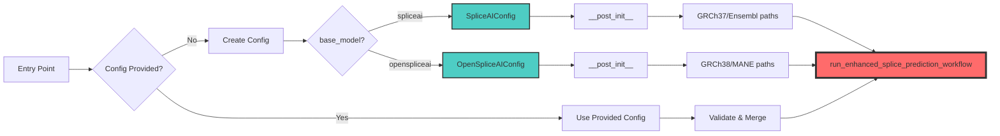

# Meta-SpliceAI Entry Point Hierarchy

**Quick Reference**: Visual map of all entry points and their convergence

---

## 🎯 The Big Picture

**All 4 entry points converge to a single core workflow function:**

```
run_enhanced_splice_prediction_workflow()
```

Located in: `meta_spliceai/splice_engine/meta_models/workflows/splice_prediction_workflow.py`

---

## 📊 Visual Hierarchy

```mermaid
graph TB
    subgraph "User Entry Points"
        U1[Python Script/Notebook]
        U2[Command Line]
        U3[Shell Script Orchestration]
    end
    
    subgraph "Entry Point Layer"
        P1["run_base_model.py<br/>run_base_model_predictions()"]
        P2["run_base_model.py<br/>predict_splice_sites()"]
        C1["cli/run_base_model_cli.py<br/>main()"]
        S1["scripts/training/<br/>process_chromosomes_sequential_smart.sh"]
    end
    
    subgraph "Configuration Factory"
        CF["Config Creation/Validation"]
        ABC["BaseModelConfig (ABC)"]
        SC["SpliceAIConfig"]
        OC["OpenSpliceAIConfig"]
    end
<!-- @import "[TOC]" {cmd="toc" depthFrom=1 depthTo=6 orderedList=false} -->

    
    subgraph "Core Workflow (Convergence Point)"
        CW["run_enhanced_splice_prediction_workflow()<br/>splice_prediction_workflow.py"]
    end
    
    subgraph "Workflow Components"
        DP["Data Preparation"]
        PL["Processing Loop<br/>(Chunks → Mini-batches)"]
        EV["Evaluation"]
        AM["Artifact Management"]
    end
    
    U1 --> P1
    U1 --> P2
    U2 --> C1
    U3 --> S1
    
    P1 --> CF
    P2 --> P1
    C1 --> P1
    S1 --> C1
    
    CF --> ABC
    ABC --> SC
    ABC --> OC
    
    SC --> CW
    OC --> CW
    
    CW --> DP
    CW --> PL
    CW --> EV
    CW --> AM
    
    style CW fill:#ff6b6b,stroke:#333,stroke-width:4px
    style ABC fill:#4ecdc4,stroke:#333,stroke-width:2px
    style CF fill:#ffe66d,stroke:#333,stroke-width:2px
```

---

## 🌳 Tree Structure

```text
META-SPLICEAI BASE LAYER ENTRY POINTS
│
├─── 📦 PYTHON API (meta_spliceai/run_base_model.py)
│    │
│    ├─── run_base_model_predictions()
│    │    │
│    │    ├─ Parameters: base_model, target_genes, target_chromosomes, config, ...
│    │    ├─ Validates: base_model ∈ {'spliceai', 'openspliceai'}
│    │    ├─ Creates: BaseModelConfig (if not provided)
│    │    │   │
│    │    │   ├─ if base_model == 'spliceai':
│    │    │   │   └─► SpliceAIConfig(**kwargs)
│    │    │   │       └─► __post_init__() → Auto-resolve GRCh37/Ensembl paths
│    │    │   │
│    │    │   └─ if base_model == 'openspliceai':
│    │    │       └─► OpenSpliceAIConfig(**kwargs)
│    │    │           └─► __post_init__() → Auto-resolve GRCh38/MANE paths
│    │    │
│    │    └─► DELEGATES TO: run_enhanced_splice_prediction_workflow()
│    │
│    └─── predict_splice_sites()  [Simplified wrapper]
│         │
│         ├─ Converts: single gene string → list
│         ├─► CALLS: run_base_model_predictions()
│         └─ Returns: Only positions DataFrame (not full results dict)
│
│
├─── 💻 CLI (meta_spliceai/cli/run_base_model_cli.py)
│    │
│    └─── main()
│         │
│         ├─ Parses: argparse arguments
│         │   ├─ --base-model (default: 'openspliceai')
│         │   ├─ --genes (list)
│         │   ├─ --chromosomes (comma-separated → list)
│         │   ├─ --mode (default: 'test')
│         │   ├─ --coverage (default: 'gene_subset')
│         │   ├─ --threshold (default: 0.5)
│         │   └─ --verbosity (default: 1)
│         │
│         ├─ Processes: 
│         │   ├─ Split chromosomes: "1,2,X" → ['1', '2', 'X']
│         │   └─ Generate test_name: "{model}_{target}_{timestamp}"
│         │
│         ├─ Creates: BaseModelConfig(base_model, mode, coverage, ...)
│         │
│         ├─► CALLS: run_base_model_predictions()
│         │
│         └─ Formats: Output summary and statistics
│
│
└─── 🔧 SHELL ORCHESTRATION (scripts/training/)
     │
     └─── process_chromosomes_sequential_smart.sh
          │
          ├─ Purpose: Full genome processing with smart checkpointing
          ├─ Activates: mamba environment (metaspliceai)
          ├─ Configuration:
          │   ├─ BASE_MODEL="openspliceai"
          │   ├─ MODE="production"
          │   ├─ COVERAGE="full_genome"
          │   └─ CHROMOSOMES=(1 2 3 ... 22 X Y)
          │
          ├─ Loop: For each chromosome
          │   │
          │   ├─ Check: Chunk-level completion status
          │   │
          │   ├─► CALLS CLI: meta-spliceai-run \
          │   │              --base-model "$BASE_MODEL" \
          │   │              --mode "$MODE" \
          │   │              --coverage "$COVERAGE" \
          │   │              --chromosomes "$CHR" \
          │   │              --verbosity 1
          │   │
          │   ├─ Monitors: Duration, success/failure
          │   └─ Verifies: Artifacts created
          │
          └─ Reports: Final summary (success count, failures, total time)
```

---

## 🔀 Delegation Paths

### Path 1: Python API (Direct)
```text
run_base_model_predictions()
    └─► run_enhanced_splice_prediction_workflow()
```

### Path 2: Python API (Simplified)
```text
predict_splice_sites()
    └─► run_base_model_predictions()
        └─► run_enhanced_splice_prediction_workflow()
```

### Path 3: CLI
```text
main()
    └─► run_base_model_predictions()
        └─► run_enhanced_splice_prediction_workflow()
```

### Path 4: Shell Script
```text
process_chromosomes_sequential_smart.sh
    └─► meta-spliceai-run (CLI)
        └─► main()
            └─► run_base_model_predictions()
                └─► run_enhanced_splice_prediction_workflow()
```

---

## 🎯 Convergence Point

```text
═══════════════════════════════════════════════════════════════════════
                        CONVERGENCE POINT
═══════════════════════════════════════════════════════════════════════

ALL PATHS LEAD TO:
    
    run_enhanced_splice_prediction_workflow()
    
    Location: meta_spliceai/splice_engine/meta_models/workflows/
              splice_prediction_workflow.py
    
    Signature:
        def run_enhanced_splice_prediction_workflow(
            config: Optional[BaseModelConfig] = None,
            target_genes: Optional[List[str]] = None,
            target_chromosomes: Optional[List[str]] = None,
            verbosity: int = 1,
            no_tn_sampling: bool = False,
            **kwargs
        ) -> Dict[str, Any]
    
    This is the CORE WORKFLOW that:
        ├─ Prepares data (genes, sequences, splice sites)
        ├─ Processes in chunks (500 genes) and mini-batches (50 genes)
        ├─ Evaluates predictions (TP/FP/FN/TN)
        ├─ Manages artifacts (checkpointing, resumption)
        └─ Returns results (positions, errors, sequences, paths)

═══════════════════════════════════════════════════════════════════════
```

---

## 📋 Entry Point Summary

| Entry Point | File | Function | Use Case |
|-------------|------|----------|----------|
| **Python API (Full)** | `run_base_model.py` | `run_base_model_predictions()` | Programmatic access with full control |
| **Python API (Simple)** | `run_base_model.py` | `predict_splice_sites()` | Quick predictions, returns only positions |
| **CLI** | `cli/run_base_model_cli.py` | `main()` | Command-line usage, formatted output |
| **Shell Script** | `scripts/training/process_chromosomes_sequential_smart.sh` | N/A | Full genome orchestration, checkpointing |

---

## 🔧 Configuration Flow



---

## 💡 Key Insights

1. **Single Convergence Point**: All 4 entry points ultimately call the same core workflow function

2. **Thin Wrappers**: Entry points are ~200-400 line wrappers providing user-friendly interfaces

3. **Model-Agnostic Core**: The core workflow works polymorphically with any `BaseModelConfig` subclass

4. **Auto-Resolution**: Each config class auto-resolves genome build-specific paths in `__post_init__()`

5. **Flexible Entry**: Users can choose their preferred interface (Python, CLI, or shell script)

---

## 🎓 For Porting

**Priority**: Port the core workflow first, then add entry point wrappers as needed.

**Essential**:
- `run_enhanced_splice_prediction_workflow()` (core workflow)
- `BaseModelConfig`, `SpliceAIConfig`, `OpenSpliceAIConfig` (configuration)

**Optional** (can add later):
- `run_base_model_predictions()` (Python API wrapper)
- `predict_splice_sites()` (simplified wrapper)
- CLI and shell scripts (orchestration)

---

**See Also**: [STAGE_1_ENTRY_POINTS_ANALYSIS.md](STAGE_1_ENTRY_POINTS_ANALYSIS.md) for detailed analysis
