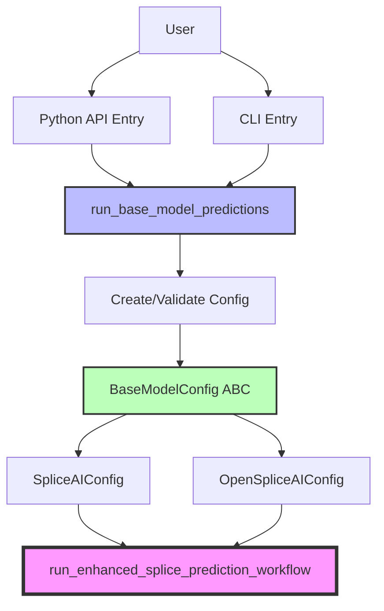
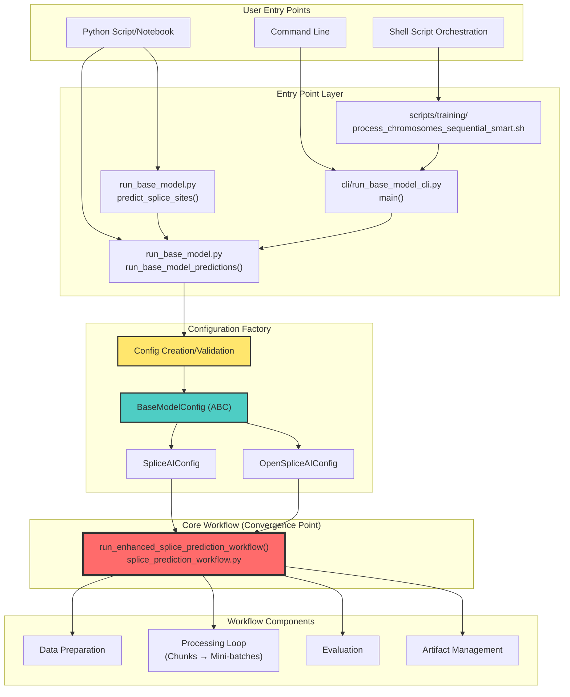
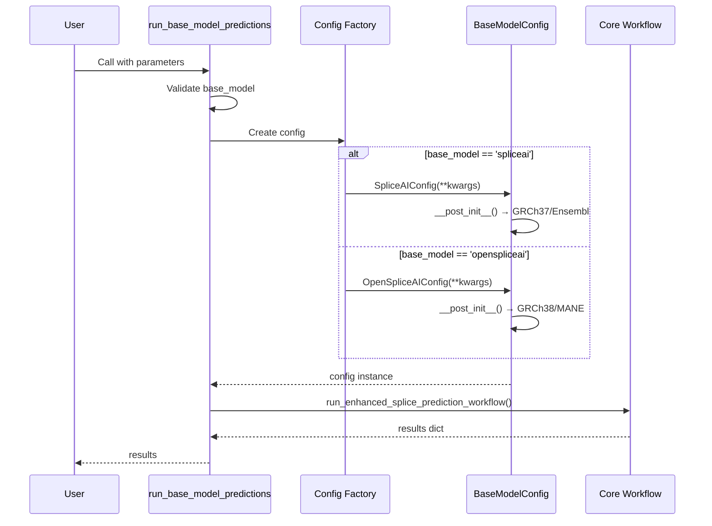
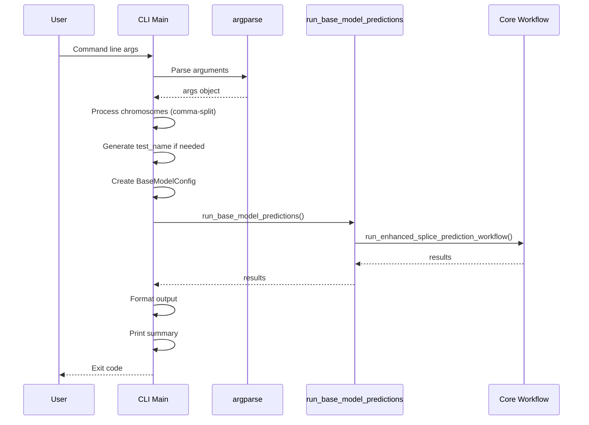
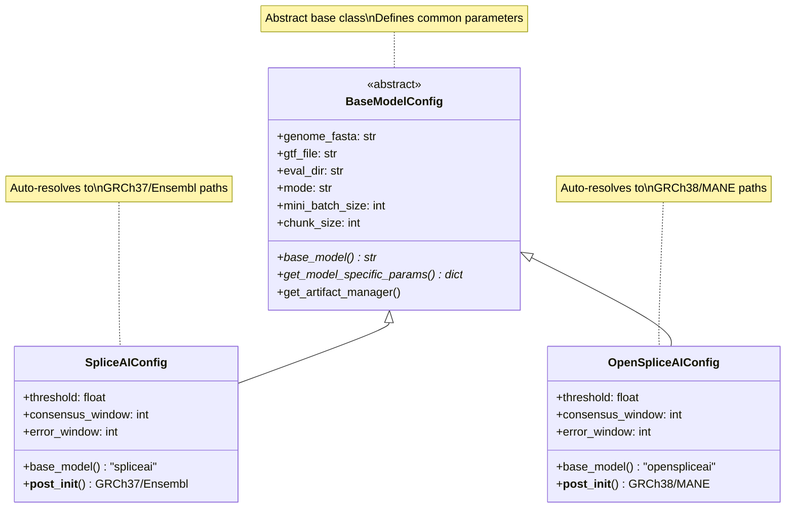
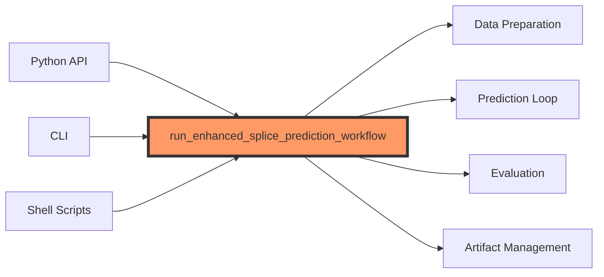
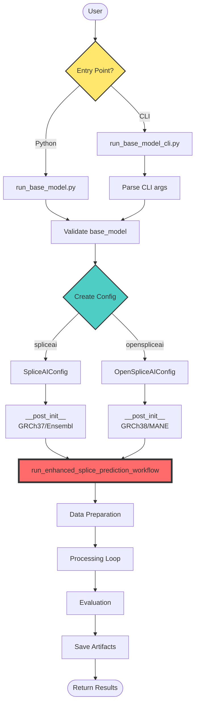

# Stage 1: Entry Points Analysis

**Date**: November 27, 2025  
**Project**: agentic-spliceai base layer porting  
**Source**: meta-spliceai base layer  
**Stage**: 1 of 6 - Understanding Entry Points

---

## Overview

This document analyzes the entry points of the meta-spliceai base layer to understand how users interact with the system and where all calls converge. This is the foundation for porting the base layer to agentic-spliceai.

**Key Finding**: Both Python API and CLI entry points are thin wrappers that converge to a single core workflow function.

---

## Entry Point Architecture

### High-Level Flow



---

## Complete Entry Point Hierarchy

### Full System Map



### Tree Structure with Delegation

```
META-SPLICEAI BASE LAYER ENTRY POINTS
│
├─── 📦 PYTHON API (meta_spliceai/run_base_model.py)
│    │
│    ├─── run_base_model_predictions()
│    │    │
│    │    ├─ Parameters: base_model, target_genes, target_chromosomes, config, ...
│    │    ├─ Validates: base_model ∈ {'spliceai', 'openspliceai'}
│    │    ├─ Creates: BaseModelConfig (if not provided)
│    │    │   │
│    │    │   ├─ if base_model == 'spliceai':
│    │    │   │   └─► SpliceAIConfig(**kwargs)
│    │    │   │       └─► __post_init__() → Auto-resolve GRCh37/Ensembl paths
│    │    │   │
│    │    │   └─ if base_model == 'openspliceai':
│    │    │       └─► OpenSpliceAIConfig(**kwargs)
│    │    │           └─► __post_init__() → Auto-resolve GRCh38/MANE paths
│    │    │
│    │    └─► DELEGATES TO: run_enhanced_splice_prediction_workflow()
│    │
│    └─── predict_splice_sites()  [Simplified wrapper]
│         │
│         ├─ Converts: single gene string → list
│         ├─► CALLS: run_base_model_predictions()
│         └─ Returns: Only positions DataFrame (not full results dict)
│
│
├─── 💻 CLI (meta_spliceai/cli/run_base_model_cli.py)
│    │
│    └─── main()
│         │
│         ├─ Parses: argparse arguments
│         │   ├─ --base-model (default: 'openspliceai')
│         │   ├─ --genes (list)
│         │   ├─ --chromosomes (comma-separated → list)
│         │   ├─ --mode (default: 'test')
│         │   ├─ --coverage (default: 'gene_subset')
│         │   ├─ --threshold (default: 0.5)
│         │   └─ --verbosity (default: 1)
│         │
│         ├─ Processes: 
│         │   ├─ Split chromosomes: "1,2,X" → ['1', '2', 'X']
│         │   └─ Generate test_name: "{model}_{target}_{timestamp}"
│         │
│         ├─ Creates: BaseModelConfig(base_model, mode, coverage, ...)
│         │
│         ├─► CALLS: run_base_model_predictions()
│         │
│         └─ Formats: Output summary and statistics
│
│
└─── 🔧 SHELL ORCHESTRATION (scripts/training/)
     │
     └─── process_chromosomes_sequential_smart.sh
          │
          ├─ Purpose: Full genome processing with smart checkpointing
          ├─ Activates: mamba environment (metaspliceai)
          ├─ Configuration:
          │   ├─ BASE_MODEL="openspliceai"
          │   ├─ MODE="production"
          │   ├─ COVERAGE="full_genome"
          │   └─ CHROMOSOMES=(1 2 3 ... 22 X Y)
          │
          ├─ Loop: For each chromosome
          │   │
          │   ├─ Check: Chunk-level completion status
          │   │
          │   ├─► CALLS CLI: meta-spliceai-run \
          │   │              --base-model "$BASE_MODEL" \
          │   │              --mode "$MODE" \
          │   │              --coverage "$COVERAGE" \
          │   │              --chromosomes "$CHR" \
          │   │              --verbosity 1
          │   │
          │   ├─ Monitors: Duration, success/failure
          │   └─ Verifies: Artifacts created
          │
          └─ Reports: Final summary (success count, failures, total time)


═══════════════════════════════════════════════════════════════════════
                        CONVERGENCE POINT
═══════════════════════════════════════════════════════════════════════

ALL PATHS LEAD TO:
    
    run_enhanced_splice_prediction_workflow()
    
    Location: meta_spliceai/splice_engine/meta_models/workflows/
              splice_prediction_workflow.py
    
    Signature:
        def run_enhanced_splice_prediction_workflow(
            config: Optional[BaseModelConfig] = None,
            target_genes: Optional[List[str]] = None,
            target_chromosomes: Optional[List[str]] = None,
            verbosity: int = 1,
            no_tn_sampling: bool = False,
            **kwargs
        ) -> Dict[str, Any]
    
    This is the CORE WORKFLOW that:
        ├─ Prepares data (genes, sequences, splice sites)
        ├─ Processes in chunks (500 genes) and mini-batches (50 genes)
        ├─ Evaluates predictions (TP/FP/FN/TN)
        ├─ Manages artifacts (checkpointing, resumption)
        └─ Returns results (positions, errors, sequences, paths)

═══════════════════════════════════════════════════════════════════════
```

### Delegation Flow Summary

```
┌─────────────────────────────────────────────────────────────────┐
│                     ENTRY POINT DELEGATION                       │
└─────────────────────────────────────────────────────────────────┘

Python API:
    run_base_model_predictions()
        └─► run_enhanced_splice_prediction_workflow()

    predict_splice_sites()
        └─► run_base_model_predictions()
            └─► run_enhanced_splice_prediction_workflow()

CLI:
    main()
        └─► run_base_model_predictions()
            └─► run_enhanced_splice_prediction_workflow()

Shell Script:
    process_chromosomes_sequential_smart.sh
        └─► meta-spliceai-run (CLI)
            └─► main()
                └─► run_base_model_predictions()
                    └─► run_enhanced_splice_prediction_workflow()

═══════════════════════════════════════════════════════════════════
RESULT: All 4 entry points converge to the same core workflow
═══════════════════════════════════════════════════════════════════
```

---

## Entry Point 1: Python API

### File Location
`meta_spliceai/run_base_model.py`

### Main Functions

#### 1. `run_base_model_predictions()`

**Purpose**: Full-featured interface for splice site prediction

**Signature**:
```python
def run_base_model_predictions(
    base_model: str = 'spliceai',
    target_genes: Optional[List[str]] = None,
    target_chromosomes: Optional[List[str]] = None,
    config: Optional[BaseModelConfig] = None,
    verbosity: int = 1,
    no_tn_sampling: bool = False,
    save_nucleotide_scores: bool = False,
    **kwargs
) -> Dict[str, Any]
```

**Parameters**:
- `base_model`: Model selection ('spliceai' or 'openspliceai')
- `target_genes`: Gene symbols/IDs to analyze
- `target_chromosomes`: Chromosomes to process
- `config`: Configuration object (BaseModelConfig subclass)
- `verbosity`: Output level (0=minimal, 1=normal, 2=detailed)
- `no_tn_sampling`: Keep all true negatives vs. sampling
- `save_nucleotide_scores`: Save per-nucleotide scores (large data)
- `**kwargs`: Additional config parameters

**Returns**: Dictionary with:
- `success`: bool - Workflow completion status
- `positions`: polars.DataFrame - All analyzed positions
- `error_analysis`: polars.DataFrame - Error positions (FP/FN)
- `analysis_sequences`: polars.DataFrame - Sequence windows
- `paths`: dict - Output file paths
- `artifact_manager`: dict - Artifact metadata

#### 2. `predict_splice_sites()`

**Purpose**: Simplified convenience function

**Signature**:
```python
def predict_splice_sites(
    genes: Union[str, List[str]],
    base_model: str = 'spliceai',
    threshold: float = 0.5,
    mode: str = 'test',
    verbosity: int = 0,
    **kwargs
) -> pl.DataFrame
```

**Returns**: Only the positions DataFrame (simplified output)

### Flow Diagram



---

## Entry Point 2: CLI

### File Location
`meta_spliceai/cli/run_base_model_cli.py`

### Command Structure

```bash
meta-spliceai-run [OPTIONS]
```

### CLI Arguments Mapping

| CLI Argument | Python Parameter | Type | Default |
|--------------|------------------|------|---------|
| `--base-model` | `base_model` | str | `'openspliceai'` |
| `--genes` | `target_genes` | List[str] | `None` |
| `--chromosomes` | `target_chromosomes` | List[str] | `None` |
| `--mode` | `mode` | str | `'test'` |
| `--coverage` | `coverage` | str | `'gene_subset'` |
| `--test-name` | `test_name` | str | Auto-generated |
| `--threshold` | `threshold` | float | `0.5` |
| `--no-tn-sampling` | `no_tn_sampling` | bool | `False` |
| `--save-nucleotide-scores` | `save_nucleotide_scores` | bool | `False` |
| `--output-dir` | `output_dir` | str | `None` |
| `--verbosity` | `verbosity` | int | `1` |

### CLI Processing

**Special Handling**:
1. **Chromosomes**: Parsed from comma-separated string → list
   ```python
   # Input: --chromosomes "1,2,X"
   # Output: ['1', '2', 'X']
   ```

2. **Test Name**: Auto-generated with timestamp
   ```python
   # Format: {base_model}_{target}_{timestamp}
   # Example: openspliceai_BRCA1_TP53_20251127_162300
   ```

### Flow Diagram



---

## Configuration Architecture

### BaseModelConfig Hierarchy



### Key Features

**Abstract Base Class Pattern**:
- `BaseModelConfig` is an ABC with abstract methods
- Each model has its own config subclass
- Auto-resolution of genome build-specific paths

**Benefits**:
- ✅ Clear naming (no confusion)
- ✅ Extensible (easy to add models)
- ✅ Type-safe (IDE autocompletion)
- ✅ Self-documenting (config class indicates model)
- ✅ Backward compatible

---

## Convergence Point

### The Core Workflow Function

**Function**: `run_enhanced_splice_prediction_workflow()`  
**Location**: `meta_spliceai/splice_engine/meta_models/workflows/splice_prediction_workflow.py`

**This is where ALL entry points converge.**



### Signature

```python
def run_enhanced_splice_prediction_workflow(
    config: Optional[BaseModelConfig] = None,
    target_genes: Optional[List[str]] = None,
    target_chromosomes: Optional[List[str]] = None,
    verbosity: int = 1,
    no_tn_sampling: bool = False,
    **kwargs
) -> Dict[str, Any]
```

**Key Insight**: This function is model-agnostic. It works with any `BaseModelConfig` subclass.

---

## Complete Entry Point Flow



---

## Key Takeaways for Porting

### 1. Entry Points are Thin Wrappers

Both Python API and CLI are ~200-400 line wrappers around the core workflow. They:
- Validate inputs
- Create/configure the config object
- Call the core workflow
- Format outputs

**Porting Strategy**: Focus on porting the core workflow, not the wrappers.

### 2. Configuration is Central

The `BaseModelConfig` hierarchy is critical:
- Defines all parameters
- Auto-resolves paths based on model
- Provides model-specific defaults

**Porting Strategy**: Port the config hierarchy first.

### 3. Single Convergence Point

All entry points converge to `run_enhanced_splice_prediction_workflow()`.

**Porting Strategy**: This is the main function to port.

### 4. Model-Agnostic Design

The core workflow doesn't care which model is used. It works polymorphically with any `BaseModelConfig` subclass.

**Porting Strategy**: Maintain this model-agnostic design.

---

## Files to Port (Stage 1 Perspective)

### Essential
1. `meta_spliceai/splice_engine/meta_models/core/model_config.py`
   - `BaseModelConfig` (ABC)
   - `SpliceAIConfig`
   - `OpenSpliceAIConfig`

2. `meta_spliceai/splice_engine/meta_models/workflows/splice_prediction_workflow.py`
   - `run_enhanced_splice_prediction_workflow()` (core function)

### Optional (Can Add Later)
3. `meta_spliceai/run_base_model.py`
   - Python API wrapper (can create simplified version)

4. `meta_spliceai/cli/run_base_model_cli.py`
   - CLI wrapper (can skip initially)

---

## Verification Checklist

After Stage 1 analysis, we can answer:

- ✅ **What are the main entry points?**
  - Python API: `run_base_model_predictions()`
  - CLI: `meta-spliceai-run` command

- ✅ **What parameters do users provide?**
  - Model selection, target genes/chromosomes, mode, coverage, thresholds

- ✅ **What is the configuration system?**
  - `BaseModelConfig` ABC with model-specific subclasses

- ✅ **Where do all calls converge?**
  - `run_enhanced_splice_prediction_workflow()` in `splice_prediction_workflow.py`

- ✅ **Is the design model-agnostic?**
  - Yes, through polymorphism and abstract base classes

---

## Next Steps

**Stage 2**: Trace the core workflow (`run_enhanced_splice_prediction_workflow()`) to understand:
- Data preparation steps
- Processing loop structure
- Evaluation logic
- Artifact management

---

## References

- **Source Files**:
  - `meta_spliceai/run_base_model.py`
  - `meta_spliceai/cli/run_base_model_cli.py`
  - `meta_spliceai/splice_engine/meta_models/core/model_config.py`
  - `meta_spliceai/splice_engine/meta_models/workflows/splice_prediction_workflow.py`

- **Related Documentation**:
  - `meta-spliceai/docs/base_models/AI_AGENT_PORTING_GUIDE.md`
  - `meta-spliceai/docs/base_models/BASE_LAYER_INTEGRATION_GUIDE.md`

---

**Status**: ✅ Stage 1 Complete  
**Next**: Stage 2 - Trace Core Workflow
