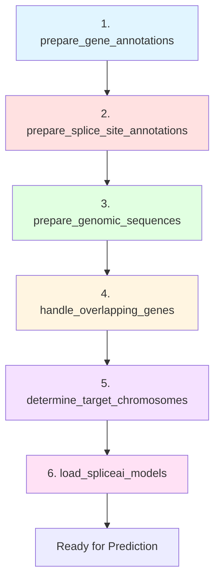

# Stage 2: Data Preparation Functions Analysis

**Purpose**: Document all data preparation functions called by the core workflow  
**Date**: November 28, 2025  
**Module**: `meta_spliceai/splice_engine/meta_models/workflows/data_preparation.py`

---

## Overview

The workflow calls 6 data preparation functions to set up all genomic resources before prediction. These functions handle extraction, loading, and filtering of genomic data.

### Data Preparation Pipeline



---

## Function 1: prepare_gene_annotations()

### Purpose
Extract and load gene annotations from GTF/GFF3 files, providing transcript-level information for all genes.

### Function Signature

```python
def prepare_gene_annotations(
    local_dir: str, 
    gtf_file: str, 
    do_extract: bool = False,
    output_filename: str = "annotations_all_transcripts.tsv",
    use_shared_db: bool = True,
    target_chromosomes: Optional[List[str]] = None,
    separator: str = "\t",
    verbosity: int = 1
) -> Dict[str, Any]
```

### Input Parameters

| Parameter | Type | Default | Description |
|-----------|------|---------|-------------|
| `local_dir` | str | - | Build-specific directory for output |
| `gtf_file` | str | - | Path to GTF/GFF3 annotation file |
| `do_extract` | bool | False | Whether to extract from GTF |
| `output_filename` | str | "annotations_all_transcripts.tsv" | Output file name |
| `use_shared_db` | bool | True | Use shared annotations.db (metadata only) |
| `target_chromosomes` | List[str] | None | Filter to specific chromosomes |
| `separator` | str | "\t" | File separator |
| `verbosity` | int | 1 | Output verbosity |

### What It Does

1. **Extraction Phase** (if `do_extract=True` or file missing):
   ```python
   from meta_spliceai.splice_engine.extract_genomic_features import extract_annotations
   
   # Creates annotations.db (SQLite database)
   # Extracts to annotations_all_transcripts.tsv
   extract_annotations(
       gtf_file, 
       db_file=os.path.join(local_dir, 'annotations.db'),
       output_file=output_file,
       sep=separator
   )
   ```

2. **Loading Phase**:
   ```python
   annot_df = pd.read_csv(
       output_file,
       sep=separator,
       low_memory=False,
       dtype={'chrom': str}  # Prevent dtype warnings
   )
   ```

3. **Filtering Phase** (if `target_chromosomes` specified):
   ```python
   normalized_chromosomes = normalize_chromosome_names(target_chromosomes)
   annot_df = annot_df[annot_df['chrom'].isin(normalized_chromosomes)]
   ```

### Output Schema

**DataFrame Columns**:
```
chrom          str      Chromosome (1-22, X, Y, MT)
start          int      Feature start position (1-based)
end            int      Feature end position (1-based)
strand         str      Strand ('+' or '-')
feature        str      Feature type (exon, CDS, UTR, etc.)
gene_id        str      Gene identifier (Ensembl ID)
transcript_id  str      Transcript identifier
```

### Files Created/Read

**Created**:
- `local_dir/annotations.db` - SQLite database with transcript metadata
- `local_dir/annotations_all_transcripts.tsv` - Full transcript annotations

**Read**:
- `gtf_file` - Input GTF/GFF3 file

### Return Value

```python
{
    'success': bool,                    # True if successful
    'annotation_file': str,             # Path to annotations TSV
    'annotation_df': pd.DataFrame       # Loaded annotations
}
```

### Key Design Notes

1. **Build-Specific Storage**: `annotations.db` contains genomic coordinates, so it's **always** stored in `local_dir` (build-specific), never shared across builds
2. **Auto-Extraction**: If file doesn't exist and `do_extract=False`, automatically enables extraction
3. **Chromosome Normalization**: Handles both "chr1" and "1" formats
4. **Low Memory Mode**: Uses `low_memory=False` to prevent dtype inference issues

---

## Function 2: prepare_splice_site_annotations()

### Purpose
Extract and load splice site annotations (donor and acceptor positions) from GTF file or use pre-computed annotations.

### Function Signature

```python
def prepare_splice_site_annotations(
    local_dir: str, 
    gtf_file: str, 
    do_extract: bool = True,
    output_filename: str = "splice_sites_enhanced.tsv",
    gene_annotations_df: Optional[Union[pd.DataFrame, pl.DataFrame]] = None,
    consensus_window: int = 2,
    separator: str = '\t',
    use_shared_db: bool = True,
    target_chromosomes: Optional[List[str]] = None,
    fasta_file: Optional[str] = None,
    verbosity: int = 1
) -> Dict[str, Any]
```

### Input Parameters

| Parameter | Type | Default | Description |
|-----------|------|---------|-------------|
| `local_dir` | str | - | Build-specific directory |
| `gtf_file` | str | - | Path to GTF file |
| `do_extract` | bool | True | Whether to extract splice sites |
| `output_filename` | str | "splice_sites_enhanced.tsv" | Output file name |
| `gene_annotations_df` | DataFrame | None | Pre-loaded annotations for filtering |
| `consensus_window` | int | 2 | Window for consensus calling |
| `separator` | str | '\t' | File separator |
| `use_shared_db` | bool | True | Use shared database |
| `target_chromosomes` | List[str] | None | Filter to chromosomes |
| `fasta_file` | str | None | FASTA file (for OpenSpliceAI fallback) |
| `verbosity` | int | 1 | Output verbosity |

### What It Does

1. **Extraction Phase** (if needed):
   ```python
   from meta_spliceai.splice_engine.extract_genomic_features import extract_splice_sites_workflow
   
   full_splice_sites_path = extract_splice_sites_workflow(
       data_prefix=local_dir,
       gtf_file=gtf_file,
       consensus_window=consensus_window
   )
   ```

2. **OpenSpliceAI Fallback** (if file missing and `fasta_file` provided):
   ```python
   from meta_spliceai.splice_engine.meta_models.openspliceai_adapter.aligned_splice_extractor import AlignedSpliceExtractor
   
   extractor = AlignedSpliceExtractor(
       coordinate_system="splicesurveyor",
       enable_biotype_filtering=False
   )
   
   splice_sites_df = extractor.extract_splice_sites(
       gtf_file=gtf_file,
       fasta_file=fasta_file,
       apply_schema_adaptation=True
   )
   ```

3. **Loading Phase**:
   ```python
   full_ss_annotations_df = read_splice_sites(
       full_splice_sites_path,
       separator=separator
   )
   ```

4. **Filtering Phase**:
   ```python
   # Filter by target genes (if gene_annotations_df provided)
   if target_genes:
       ss_annotations_df = ss_annotations_df[
           ss_annotations_df['gene_id'].isin(target_genes)
       ]
   
   # Filter by chromosomes (if target_chromosomes provided)
   if target_chromosomes:
       normalized_chromosomes = normalize_chromosome_names(target_chromosomes)
       ss_annotations_df = ss_annotations_df[
           ss_annotations_df['chrom'].isin(normalized_chromosomes)
       ]
   ```

### Output Schema

**DataFrame Columns**:
```
chrom          str      Chromosome
start          int      Splice site start position
end            int      Splice site end position
strand         str      Strand ('+' or '-')
splice_type    str      'donor' or 'acceptor'
gene_id        str      Gene identifier
transcript_id  str      Transcript identifier
```

### Files Created/Read

**Created**:
- `local_dir/splice_sites_enhanced.tsv` - Full splice site annotations
- `local_dir/{output_filename}` - Filtered splice sites (if different)

**Read**:
- `gtf_file` - Input GTF file
- `fasta_file` - Genome FASTA (for OpenSpliceAI fallback)

### Return Value

```python
{
    'success': bool,                    # True if successful
    'splice_sites_file': str,           # Path to splice sites file
    'splice_sites_df': DataFrame,       # Loaded splice sites
    'error': str                        # Error message (if failed)
}
```

### Key Design Notes

1. **Build-Specific**: Splice sites contain coordinates, so **always** stored in `local_dir`
2. **Two Extraction Methods**:
   - Native: `extract_splice_sites_workflow()` (MetaSpliceAI)
   - Fallback: `AlignedSpliceExtractor()` (OpenSpliceAI adapter)
3. **Inference Safety**: During inference (`do_extract=False`), never writes to disk
4. **Sequential Filtering**: First by genes, then by chromosomes
5. **Dual Format Support**: Handles both pandas and polars DataFrames

---

## Function 3: prepare_genomic_sequences()

### Purpose
Extract and load genomic sequences for genes or transcripts from FASTA file.

### Function Signature

```python
def prepare_genomic_sequences(
    local_dir: str,
    gtf_file: str,
    genome_fasta: str,
    mode: str = 'gene',
    seq_type: str = 'full',
    do_extract: bool = True,
    chromosomes: Optional[List[str]] = None,
    genes: Optional[List[str]] = None,  
    test_mode: bool = False,
    seq_format: str = 'parquet',
    single_sequence_file: bool = False,
    force_overwrite: bool = False,
    verbosity: int = 1
) -> Dict[str, Any]
```

### Input Parameters

| Parameter | Type | Default | Description |
|-----------|------|---------|-------------|
| `local_dir` | str | - | Output directory |
| `gtf_file` | str | - | Path to GTF file |
| `genome_fasta` | str | - | Path to genome FASTA |
| `mode` | str | 'gene' | 'gene' or 'transcript' |
| `seq_type` | str | 'full' | 'full' or 'minmax' |
| `do_extract` | bool | True | Whether to extract sequences |
| `chromosomes` | List[str] | None | Target chromosomes |
| `genes` | List[str] | None | Target genes |
| `test_mode` | bool | False | Test mode flag |
| `seq_format` | str | 'parquet' | Output format |
| `single_sequence_file` | bool | False | Single file for all chromosomes |
| `force_overwrite` | bool | False | Re-extract even if exists |
| `verbosity` | int | 1 | Output verbosity |

### What It Does

1. **Mode Selection**:
   ```python
   if mode == 'gene':
       seq_df_path, do_extract = _process_gene_sequences(...)
   else:  # mode == 'transcript'
       seq_df_path, do_extract = _process_transcript_sequences(...)
   ```

2. **Gene Mode** (`_process_gene_sequences`):
   - Extracts full gene sequences (start to end)
   - Or minmax sequences (min exon start to max exon end)
   - Stores per-chromosome or single file

3. **Transcript Mode** (`_process_transcript_sequences`):
   - Extracts individual transcript sequences
   - Includes exon boundaries
   - More detailed than gene mode

4. **File Organization**:
   ```
   local_dir/
   ├── gene_sequences_chr1.parquet
   ├── gene_sequences_chr2.parquet
   └── ...
   
   OR (if single_sequence_file=True):
   
   local_dir/
   └── gene_sequences_all.parquet
   ```

### Output Schema

**Gene Mode Columns**:
```
gene_id        str      Gene identifier
chrom          str      Chromosome
start          int      Gene start position
end            int      Gene end position
strand         str      Strand
sequence       str      Nucleotide sequence
```

**Transcript Mode Columns**:
```
transcript_id  str      Transcript identifier
gene_id        str      Gene identifier
chrom          str      Chromosome
start          int      Transcript start
end            int      Transcript end
strand         str      Strand
sequence       str      Nucleotide sequence
exon_starts    str      Comma-separated exon starts
exon_ends      str      Comma-separated exon ends
```

### Files Created/Read

**Created**:
- `local_dir/gene_sequences_chr{N}.parquet` - Per-chromosome sequences
- `local_dir/transcript_sequences_chr{N}.parquet` - Per-chromosome transcripts
- OR `local_dir/gene_sequences_all.parquet` - All chromosomes

**Read**:
- `gtf_file` - Gene annotations
- `genome_fasta` - Reference genome

### Return Value

```python
{
    'success': bool,                    # True if successful
    'sequences_file': str,              # Path to sequence file(s)
    'sequences_df': DataFrame,          # Loaded sequences (optional)
    'error': str                        # Error message (if failed)
}
```

### Key Design Notes

1. **Memory Efficient**: Processes per-chromosome to avoid loading entire genome
2. **Format Flexibility**: Supports parquet (default) or CSV
3. **Lazy Loading**: Can return file paths without loading into memory
4. **Force Overwrite**: Useful for updating sequences after annotation changes

---

## Function 4: handle_overlapping_genes()

### Purpose
Identify and track genes with overlapping genomic regions, which can cause ambiguity in splice site assignment.

### Function Signature

```python
def handle_overlapping_genes(
    local_dir: str,
    gtf_file: str,
    do_find: bool = True,
    min_exons: int = 2,
    filter_valid_splice_sites: bool = True,
    separator: str = '\t',
    output_format: str = 'pd',
    verbosity: int = 1,
    target_chromosomes: Optional[List[str]] = None
) -> Dict[str, Any]
```

### Input Parameters

| Parameter | Type | Default | Description |
|-----------|------|---------|-------------|
| `local_dir` | str | - | Output directory |
| `gtf_file` | str | - | Path to GTF file |
| `do_find` | bool | True | Whether to find overlaps |
| `min_exons` | int | 2 | Minimum exons per gene |
| `filter_valid_splice_sites` | bool | True | Filter for valid splice sites |
| `separator` | str | '\t' | File separator |
| `output_format` | str | 'pd' | 'pd' (pandas) or 'pl' (polars) |
| `verbosity` | int | 1 | Output verbosity |
| `target_chromosomes` | List[str] | None | Target chromosomes |

### What It Does

1. **Find Overlaps** (using `SpliceAnalyzer`):
   ```python
   from meta_spliceai.splice_engine.meta_models.core.analyzers.splice import SpliceAnalyzer
   
   analyzer = SpliceAnalyzer(data_dir=local_dir)
   
   overlapping_df = analyzer.retrieve_overlapping_gene_metadata(
       min_exons=min_exons,
       filter_valid_splice_sites=filter_valid_splice_sites,
       output_format='dataframe',
       to_pandas=(output_format == 'pd'),
       target_chromosomes=target_chromosomes
   )
   ```

2. **Overlap Detection Logic**:
   - Compares gene coordinates on same chromosome and strand
   - Identifies genes with overlapping exons
   - Counts number of overlapping partners per gene

3. **Save Results**:
   ```python
   overlapping_df.to_csv(
       os.path.join(local_dir, "overlapping_gene_counts.tsv"),
       sep=separator,
       index=False
   )
   ```

### Output Schema

**DataFrame Columns**:
```
gene_id                str      Gene identifier
chrom                  str      Chromosome
strand                 str      Strand
start                  int      Gene start position
end                    int      Gene end position
overlapping_count      int      Number of overlapping genes
overlapping_gene_ids   str      Comma-separated overlapping gene IDs
```

### Files Created/Read

**Created**:
- `local_dir/overlapping_gene_counts.tsv` - Overlapping gene metadata

**Read**:
- `gtf_file` - Gene annotations (via SpliceAnalyzer)

### Return Value

```python
{
    'success': bool,                    # True if successful
    'overlapping_file': str,            # Path to overlapping genes file
    'overlapping_df': DataFrame         # Loaded overlapping genes
}
```

### Key Design Notes

1. **Purpose**: Helps identify ambiguous splice sites shared by multiple genes
2. **Filtering**: Can filter to genes with minimum exon count and valid splice sites
3. **Chromosome-Specific**: Can target specific chromosomes
4. **Format Flexibility**: Returns pandas or polars DataFrame

---

## Function 5: determine_target_chromosomes()

### Purpose
Determine which chromosomes to process based on configuration and available data.

### Function Signature

```python
def determine_target_chromosomes(
    chromosomes: Optional[List[str]] = None,
    target_genes: Optional[List[str]] = None,
    gene_annotations_df: Optional[pd.DataFrame] = None,
    verbosity: int = 1
) -> List[str]
```

### Input Parameters

| Parameter | Type | Default | Description |
|-----------|------|---------|-------------|
| `chromosomes` | List[str] | None | Explicitly specified chromosomes |
| `target_genes` | List[str] | None | Target genes (infer chromosomes) |
| `gene_annotations_df` | DataFrame | None | Gene annotations for inference |
| `verbosity` | int | 1 | Output verbosity |

### What It Does

1. **Priority 1**: Use explicitly specified chromosomes
   ```python
   if chromosomes:
       return normalize_chromosome_names(chromosomes)
   ```

2. **Priority 2**: Infer from target genes
   ```python
   if target_genes and gene_annotations_df is not None:
       # Filter annotations to target genes
       target_annot = gene_annotations_df[
           gene_annotations_df['gene_id'].isin(target_genes)
       ]
       # Extract unique chromosomes
       chroms = target_annot['chrom'].unique().tolist()
       return normalize_chromosome_names(chroms)
   ```

3. **Priority 3**: Use all standard chromosomes
   ```python
   # Default: all autosomes + sex chromosomes
   return [str(i) for i in range(1, 23)] + ['X', 'Y']
   ```

### Return Value

```python
List[str]  # Normalized chromosome names (e.g., ['1', '2', 'X'])
```

### Key Design Notes

1. **Smart Inference**: Can infer chromosomes from target genes
2. **Normalization**: Always normalizes chromosome names
3. **Fallback**: Defaults to all standard chromosomes
4. **Optimization**: Reduces processing scope when possible

---

## Function 6: load_spliceai_models()

### Purpose
Load pre-trained SpliceAI Keras models for splice site prediction.

### Function Signature

```python
def load_spliceai_models(verbosity: int = 1) -> Dict[str, Any]
```

### Input Parameters

| Parameter | Type | Default | Description |
|-----------|------|---------|-------------|
| `verbosity` | int | 1 | Output verbosity |

### What It Does

1. **Import Dependencies**:
   ```python
   from keras.models import load_model
   from meta_spliceai.splice_engine.run_spliceai_workflow import load_spliceai_models
   ```

2. **Load Models**:
   ```python
   models = load_spliceai_models()
   # Returns list of 5 Keras models (ensemble)
   ```

3. **Model Details**:
   - 5 pre-trained models (ensemble)
   - Each model predicts donor, acceptor, neither probabilities
   - Models are averaged for final predictions

### Files Read

**Model Files** (from SpliceAI package):
```
spliceai/models/
├── spliceai1.h5
├── spliceai2.h5
├── spliceai3.h5
├── spliceai4.h5
└── spliceai5.h5
```

### Return Value

```python
{
    'success': bool,                    # True if successful
    'models': List[keras.Model],        # List of loaded models
    'error': str                        # Error message (if failed)
}
```

### Key Design Notes

1. **Ensemble**: Uses 5 models for robustness
2. **Lazy Loading**: Only loads when needed
3. **Error Handling**: Gracefully handles missing models
4. **Reusable**: Models can be reused across multiple predictions

---

## Data Preparation Summary

### Execution Order


### Files Created

| File | Function | Purpose |
|------|----------|---------|
| `annotations.db` | prepare_gene_annotations | SQLite database with transcript metadata |
| `annotations_all_transcripts.tsv` | prepare_gene_annotations | Full transcript annotations |
| `splice_sites_enhanced.tsv` | prepare_splice_site_annotations | Full splice site annotations |
| `gene_sequences_chr{N}.parquet` | prepare_genomic_sequences | Per-chromosome gene sequences |
| `overlapping_gene_counts.tsv` | handle_overlapping_genes | Overlapping gene metadata |

### Data Flow

```
GTF File
  ├─► annotations.db (metadata)
  ├─► annotations_all_transcripts.tsv (coordinates)
  └─► splice_sites_enhanced.tsv (splice sites)

FASTA File
  └─► gene_sequences_chr{N}.parquet (sequences)

Annotations + Splice Sites
  └─► overlapping_gene_counts.tsv (overlaps)

SpliceAI Package
  └─► models (5 Keras models)
```

### Memory Considerations

| Function | Memory Impact | Mitigation |
|----------|---------------|------------|
| prepare_gene_annotations | Medium | Filters by chromosome |
| prepare_splice_site_annotations | Medium | Sequential filtering |
| prepare_genomic_sequences | High | Per-chromosome processing |
| handle_overlapping_genes | Low | Metadata only |
| determine_target_chromosomes | Minimal | Logic only |
| load_spliceai_models | High | 5 large models (~500MB each) |

---

## Key Takeaways for Porting

### Must Port (Essential)

1. ✅ **prepare_gene_annotations()** - Core annotation loading
2. ✅ **prepare_splice_site_annotations()** - Reference splice sites
3. ✅ **load_spliceai_models()** - Model loading

### Can Simplify (Optional)

- ⚠️ **prepare_genomic_sequences()** - Can skip if not using sequence features
- ⚠️ **handle_overlapping_genes()** - Can skip for initial port
- ⚠️ **determine_target_chromosomes()** - Can use simpler logic

### Critical Dependencies

```
extract_genomic_features.py
  ├─ extract_annotations()
  └─ extract_splice_sites_workflow()

run_spliceai_workflow.py
  └─ load_spliceai_models()

SpliceAnalyzer
  └─ retrieve_overlapping_gene_metadata()
```

### Build-Specific vs. Shared

**Build-Specific** (in `local_dir`):
- ✅ `annotations.db` - Contains coordinates
- ✅ `splice_sites_enhanced.tsv` - Contains coordinates
- ✅ `gene_sequences_*.parquet` - Build-specific sequences

**Can Be Shared** (across analyses, same build):
- ⚠️ None - All contain build-specific coordinates

---

**Next**: Section 3 - Main Processing Loop (Lines 500-1005)

This will analyze the nested loop structure for chromosome and gene processing.
