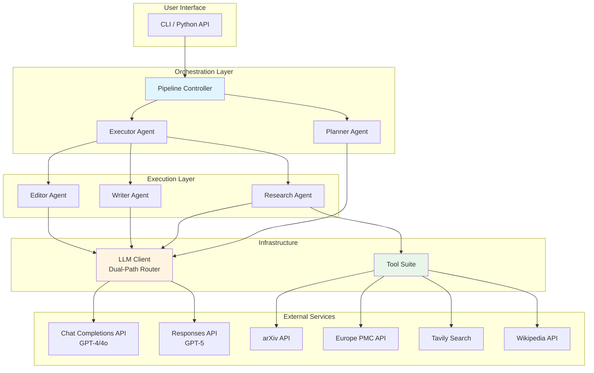
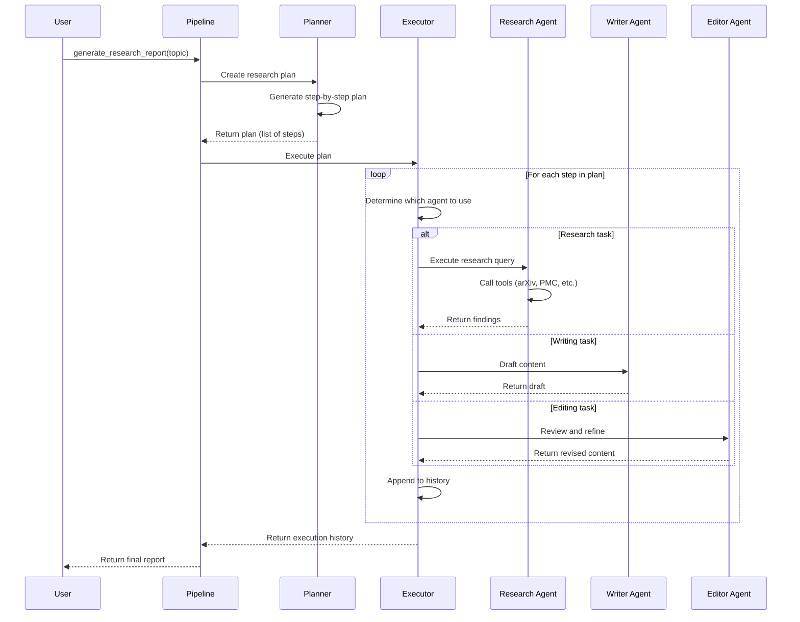
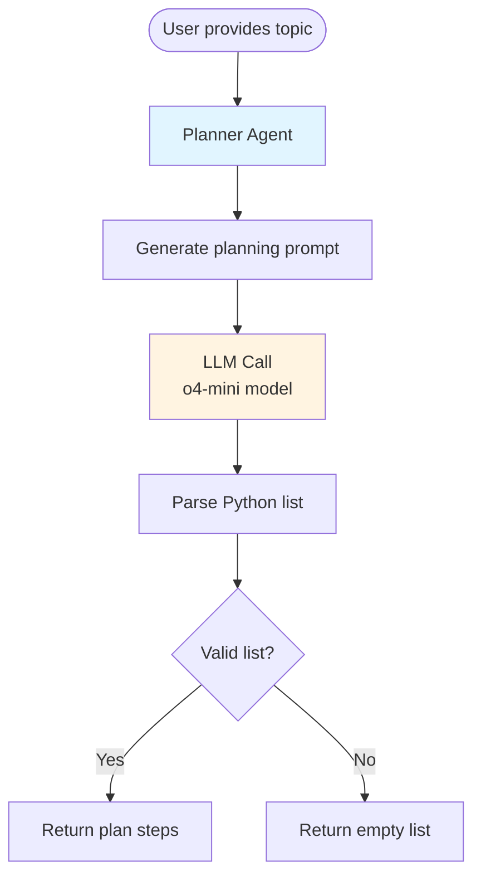
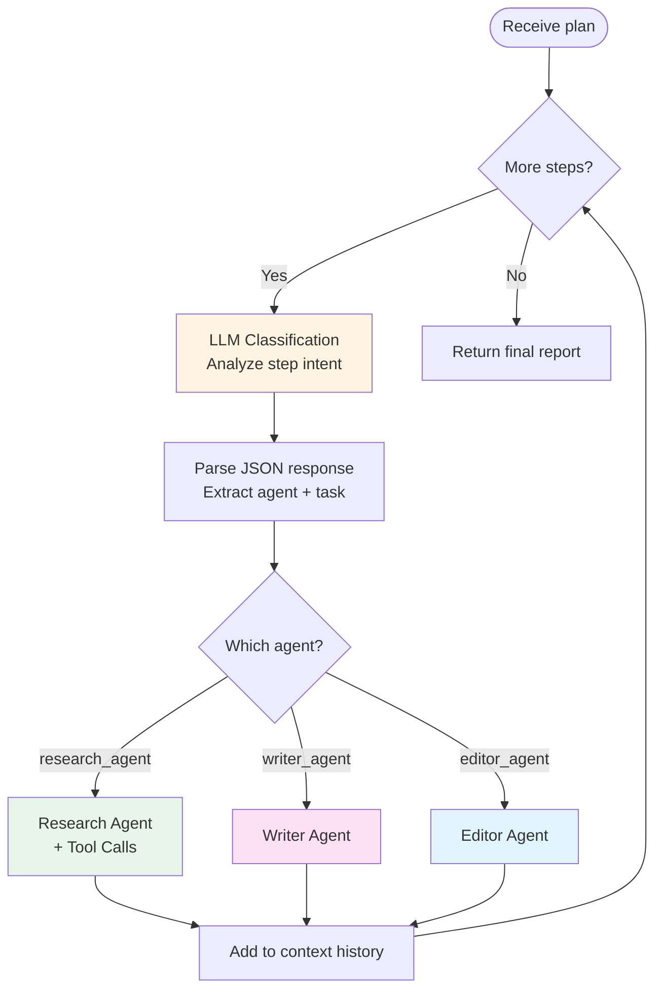
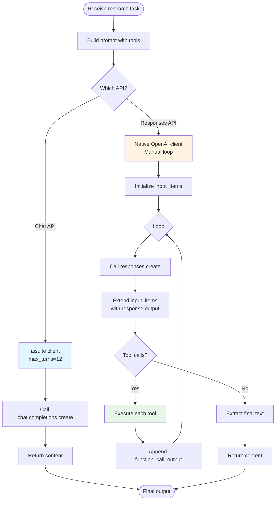
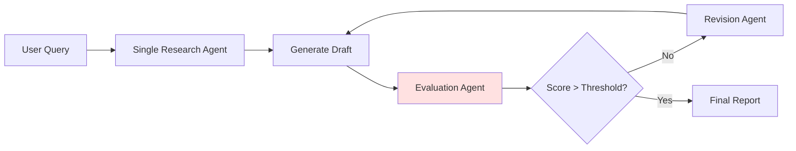
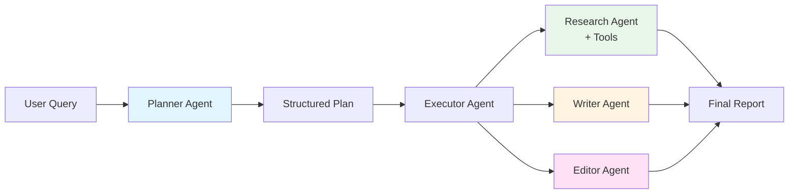
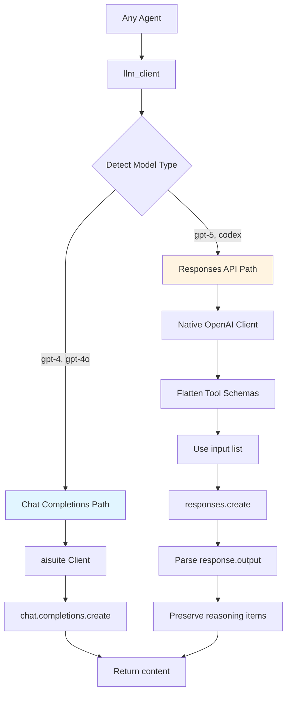
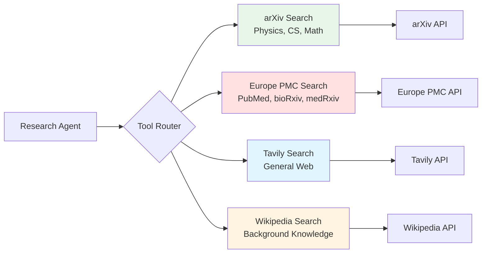

# Multiagent Research Workflow: A Tutorial

## Table of Contents
1. [Overview](#overview)
2. [Architecture](#architecture)
3. [The Multiagent Pattern](#the-multiagent-pattern)
4. [Workflow Deep Dive](#workflow-deep-dive)
5. [Comparison with Previous Approaches](#comparison-with-previous-approaches)
6. [API Compatibility](#api-compatibility)
7. [Advanced Features](#advanced-features)

---

## Overview

The **Multiagent Research Agent** is a sophisticated system that orchestrates multiple specialized AI agents to produce comprehensive research reports. Unlike monolithic approaches, this system decomposes the research task into distinct phases handled by expert agents, resulting in higher quality, more structured outputs.

### Key Advantages

- **Specialization**: Each agent is optimized for a specific task (planning, research, writing, editing)
- **Iterative Refinement**: Multi-stage workflow allows for progressive improvement
- **Tool Integration**: Direct access to academic databases (arXiv, Europe PMC), web search (Tavily), and encyclopedic knowledge (Wikipedia)
- **API Flexibility**: Supports both Chat Completions API (GPT-4) and Responses API (GPT-5)
- **Transparency**: Clear separation of concerns makes the system auditable and debuggable

---

## Architecture

### High-Level System Design



### Package Structure

```
multiagent/research_agent/
├── __init__.py           # Package exports
├── agents.py             # All agent implementations
├── llm_client.py         # Unified LLM interface (dual-path)
├── tools.py              # Research tool implementations
├── utils.py              # Helper functions
├── pipeline.py           # Workflow orchestration
├── run.py                # CLI entry point
├── README.md             # Package documentation
└── docs/
    └── MULTIAGENT_WORKFLOW_TUTORIAL.md  # This file
```

---

## The Multiagent Pattern

### What is a Multiagent System?

A **multiagent system** decomposes a complex task into subtasks, each handled by a specialized agent. Agents communicate through a structured protocol, passing intermediate results to downstream agents.

### Our Implementation: Planning → Execution Pattern



### Agent Roles

| Agent | Responsibility | Input | Output |
|-------|---------------|-------|--------|
| **Planner** | Generates a step-by-step research plan | Research topic | List of executable steps |
| **Research** | Gathers information using external tools | Research query | Structured findings |
| **Writer** | Drafts sections based on research | Writing task + context | Draft content |
| **Editor** | Reviews and refines drafts | Draft content | Polished content |
| **Executor** | Routes tasks to appropriate agents | Plan steps | Execution history |

---

## Workflow Deep Dive

### Phase 1: Planning

The **Planner Agent** receives a research topic and generates a structured plan.



**Example Plan Output:**
```python
[
    "Search arXiv for recent papers on quantum computing",
    "Search Europe PMC for biomedical applications of quantum computing",
    "Search Wikipedia for background on quantum computing principles",
    "Draft an introduction section summarizing quantum computing",
    "Draft a section on recent advances based on arXiv findings",
    "Draft a section on biomedical applications based on PMC findings",
    "Review and refine the introduction for clarity",
    "Generate a final Markdown document with all sections"
]
```

### Phase 2: Execution

The **Executor Agent** processes each step, routing it to the appropriate specialist agent.

#### How Routing Works

The Executor uses **LLM-based intelligent routing** to classify each step:

1. **For each step in the plan**, the Executor sends a classification prompt to the LLM
2. **The LLM analyzes** the step and returns a JSON object: `{"agent": "research_agent", "task": "..."}`
3. **The Executor calls** the appropriate agent with the extracted task
4. **Results are appended** to the execution history for downstream agents

**Example Routing:**

| Plan Step | LLM Classification | Routed To |
|-----------|-------------------|-----------|
| "Search arXiv for recent papers on quantum computing" | `{"agent": "research_agent", "task": "Search arXiv..."}` | Research Agent |
| "Draft an introduction section summarizing quantum computing" | `{"agent": "writer_agent", "task": "Draft an introduction..."}` | Writer Agent |
| "Review and refine the introduction for clarity" | `{"agent": "editor_agent", "task": "Review and refine..."}` | Editor Agent |

This approach is **more robust than keyword matching** because:

- It handles natural language variations ("Find papers" vs "Search for" vs "Look up")
- It understands context (distinguishes "draft" from "revise")
- It's extensible (new agents can be added without updating regex patterns)

**Implementation Detail:**

```python
# From agents.py - executor_agent function
for i, step in enumerate(plan_steps):
    agent_decision_prompt = f"""
You are an execution manager for a multi-agent research team.

Given the following instruction, identify which agent should perform it and extract the clean task.

Return only a valid JSON object with two keys:
- "agent": one of ["research_agent", "editor_agent", "writer_agent"]
- "task": a string with the instruction that the agent should follow

Only respond with a valid JSON object. Do not include explanations or markdown formatting.

Instruction: "{step}"
"""
    messages = [{"role": "user", "content": agent_decision_prompt}]
    content = llm_client.call_llm_text(client, model, messages, temperature=0.0)
    
    # Parse the JSON response
    agent_info = json.loads(clean_json_block(content))
    agent_name = agent_info["agent"]
    task = agent_info["task"]
    
    # Route to the appropriate agent
    if agent_name in agent_registry:
        result = agent_registry[agent_name](task, model=model)
        history.append({"step": step, "agent": agent_name, "result": result})
```

The key insight: **The Executor itself is an LLM-powered agent** that performs meta-reasoning about which specialist agent should handle each task.



### Phase 3: Research with Tools

The **Research Agent** is the most complex, as it performs an **agentic loop** with tool calls.



**Tool Execution Example:**

When the Research Agent encounters a query like *"Find recent papers on CRISPR gene editing"*, it:

1. **Decides** which tool to use (e.g., `europe_pmc_search_tool` for biomedical topics)
2. **Calls** the tool with arguments: `{"query": "CRISPR gene editing", "max_results": 5}`
3. **Receives** structured results (titles, authors, abstracts, URLs)
4. **Synthesizes** the findings into a coherent summary
5. **Returns** the summary to the Executor

---

## Comparison with Previous Approaches

### Previous Model: `eval/research_agent/`

The `eval/research_agent/` package used an **evaluation-based approach**:



**Characteristics:**
- **Single-agent** with post-hoc evaluation
- **Iterative refinement** based on quality scores
- **Component-wise evaluation** (clarity, completeness, accuracy)
- **Revision loop** until quality threshold met

**Limitations:**
1. **Reactive**: Evaluation happens *after* generation, leading to wasted computation
2. **Monolithic**: Single agent handles all aspects (research, writing, structure)
3. **Limited Tool Use**: Less emphasis on external data sources
4. **Quality Ceiling**: Revision can only fix existing content, not restructure approach

### Current Model: `multiagent/research_agent/`

The multiagent approach is **proactive** and **specialized**:



**Characteristics:**
- **Multi-agent** with specialized roles
- **Proactive planning** before execution
- **Rich tool integration** (4 research tools)
- **Contextual refinement** (each agent sees prior work)

**Advantages:**

| Aspect | `eval/research_agent/` | `multiagent/research_agent/` |
|--------|------------------------|------------------------------|
| **Planning** | Implicit (within agent) | Explicit (Planner Agent) |
| **Tool Use** | Limited | Extensive (arXiv, PMC, Tavily, Wikipedia) |
| **Specialization** | Single generalist | Multiple specialists |
| **Quality Control** | Post-hoc evaluation | Built-in via Editor Agent |
| **Transparency** | Opaque (single step) | Transparent (visible plan) |
| **Efficiency** | Iterative revisions | Directed execution |
| **API Support** | Chat API only | Chat + Responses API |

### Why Multiagent Produces Stronger Reports

1. **Better Information Gathering**: Direct access to 4 specialized research tools vs. relying on model's training data
2. **Structured Thinking**: Explicit planning phase ensures comprehensive coverage
3. **Specialization**: Each agent is optimized for its task (research vs. writing vs. editing)
4. **Contextual Awareness**: Agents see the full history, enabling coherent synthesis
5. **Proactive Quality**: Editor Agent refines content *as part of the workflow*, not as a fix

**Example Comparison:**

**Topic**: "Recent advances in mRNA vaccine technology"

**`eval/research_agent/` approach:**
1. Generate draft (based on training data)
2. Evaluate draft (score: 6/10 - lacks recent citations)
3. Revise draft (add more detail, but still limited by training cutoff)
4. Re-evaluate (score: 7/10 - acceptable)

**`multiagent/research_agent/` approach:**
1. **Planner**: Create plan (search PMC, search arXiv, draft intro, draft findings, edit)
2. **Research**: Query Europe PMC for 2024 papers → Get 5 recent papers with abstracts
3. **Research**: Query arXiv for preprints → Get 3 cutting-edge preprints
4. **Writer**: Draft introduction using Wikipedia background
5. **Writer**: Draft findings section citing the 8 papers found
6. **Editor**: Refine for clarity and flow
7. **Final Report**: Contains 8 real citations from 2024, structured sections, polished prose

---

## API Compatibility

### Dual-Path Architecture

The system supports both **Chat Completions API** (GPT-4) and **Responses API** (GPT-5) through a unified `llm_client` module.



### Key Differences

| Aspect | Chat Completions API | Responses API |
|--------|---------------------|---------------|
| **Tool Schema** | Nested: `{type, function: {name, ...}}` | Flattened: `{type, name, ...}` |
| **Input Format** | `messages` list | `input` list (can be messages) |
| **Tool Handling** | `max_turns` parameter | Manual loop required |
| **Response Structure** | `response.choices[0].message` | `response.output` (list of items) |
| **Tool Calls** | `message.tool_calls` | Items with `type='function_call'` |
| **Reasoning** | Implicit | Explicit `reasoning` items |

### Critical Implementation Detail: Reasoning Preservation

For GPT-5 models, the Responses API generates **reasoning items** before tool calls. These must be preserved in the conversation history:

```python
# ❌ WRONG: Only append tool call
input_items.append(tool_call)

# ✅ CORRECT: Append entire response.output first
input_items.extend(response.output)  # Includes reasoning + tool calls

# Then append tool results
input_items.append({
    "type": "function_call_output",
    "call_id": tool_call.call_id,
    "output": json.dumps(result)
})
```

**Why this matters**: Without reasoning items, subsequent API calls fail with:
```
Error 400: Missing required "reasoning" component for function call item
```

---

## Advanced Features

### 1. Tool Suite

The Research Agent has access to 4 specialized tools:



**Tool Selection Strategy:**

The Research Agent intelligently selects tools based on the query:

- **Academic papers** (physics, CS, math) → arXiv
- **Biomedical research** (biology, medicine) → Europe PMC
- **Current events, general facts** → Tavily
- **Background concepts, definitions** → Wikipedia

### 2. Context Propagation

Each agent receives the **full execution history**, enabling coherent synthesis:

```python
enriched_task = f"""You are {agent_name}.

Here is the context of what has been done so far:
{context}

Your next task is:
{task}
"""
```

This ensures:
- **Writer Agent** can reference research findings
- **Editor Agent** can refine based on complete document structure
- **No information loss** between steps

### 3. Extensibility

Adding a new agent is straightforward:

```python
# 1. Define the agent function
def summarizer_agent(task: str, model: str = "openai:gpt-4o") -> str:
    messages = [
        {"role": "system", "content": "You are a summarization expert."},
        {"role": "user", "content": task}
    ]
    return llm_client.call_llm_text(client, model, messages, temperature=0.5)

# 2. Register in agent_registry
agent_registry = {
    "research_agent": research_agent,
    "writer_agent": writer_agent,
    "editor_agent": editor_agent,
    "summarizer_agent": summarizer_agent,  # New!
}
```

The Executor will automatically route tasks to the new agent.

---

## Usage Examples

### Basic Usage

```python
from multiagent.research_agent.pipeline import generate_research_report

# Generate a report
result = generate_research_report(
    topic="Quantum computing applications in drug discovery",
    model="openai:gpt-4o"
)

print(result['final_report'])
```

### CLI Usage

```bash
# Using GPT-4o (Chat API)
python -m multiagent.research_agent.run "Climate change mitigation strategies"

# Using GPT-5 (Responses API)
python -m multiagent.research_agent.run \
    "CRISPR gene editing advances" \
    --model openai:gpt-5.1-codex-mini \
    --output my_report.md
```

### Advanced: Custom Model Configuration

```python
from multiagent.research_agent.pipeline import generate_research_report

# Use different models for different agents
result = generate_research_report(
    topic="Neuromorphic computing architectures",
    model="openai:gpt-5.1-codex-mini"  # All agents use GPT-5
)

# The llm_client automatically handles API routing
```

---

## Conclusion

The **Multiagent Research Agent** represents a significant evolution in AI-powered research systems:

1. **Specialization over Generalization**: Multiple expert agents outperform a single generalist
2. **Proactive over Reactive**: Planning before execution beats post-hoc evaluation
3. **Tool-Augmented over Knowledge-Limited**: Direct API access beats relying on training data
4. **Transparent over Opaque**: Visible workflow enables debugging and trust
5. **Future-Proof**: Dual-path API support ensures compatibility with next-gen models

By decomposing the research task into planning, research, writing, and editing phases—each handled by a specialized agent with appropriate tools—the system produces reports that are more comprehensive, better structured, and grounded in current information.

---

## Further Reading

- **Package README**: `multiagent/research_agent/README.md`
- **API Integration Guide**: `multiagent/market_research/docs/responses_api/gpt5_integration.md`
- **Tool Implementations**: `multiagent/research_agent/tools.py`
- **LLM Client Source**: `multiagent/research_agent/llm_client.py`

---

*Document Version: 1.0*  
*Last Updated: 2025-11-20*
