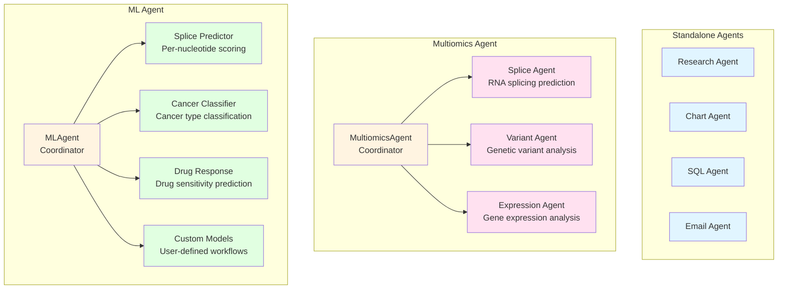
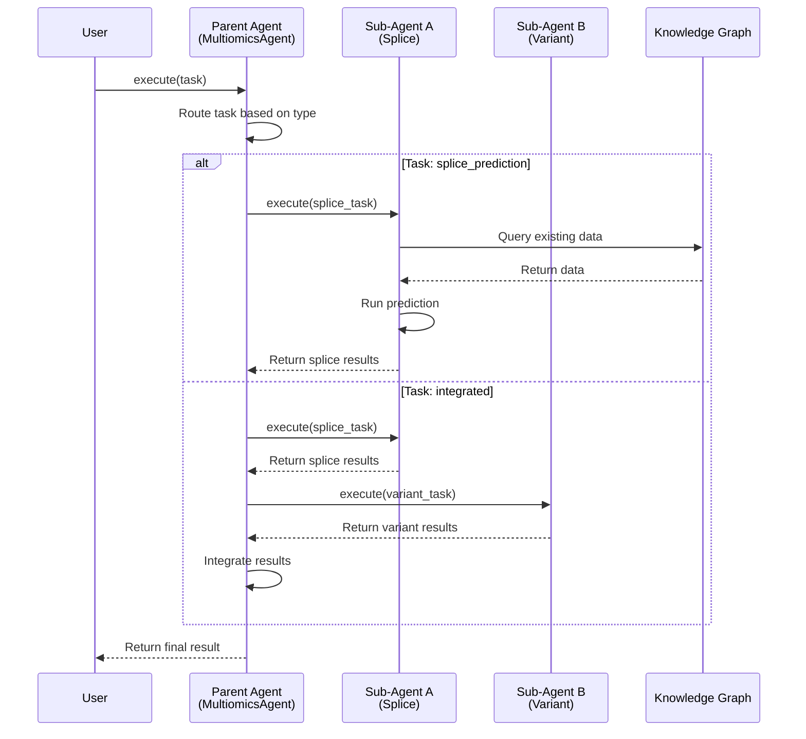

# Hierarchical Agent Architecture

## Overview

Nexus supports hierarchical agent organization, allowing complex domains like multiomics and machine learning to be decomposed into specialized sub-agents. This enables:

- **Domain Specialization**: Each sub-agent focuses on a specific task
- **Modular Development**: Sub-agents can be developed independently
- **Flexible Composition**: Combine sub-agents for complex workflows
- **Scalability**: Easy to add new specialized capabilities

## Architecture Pattern

### Parent Agent

A parent agent (e.g., `MultiomicsAgent`, `MLAgent`) serves as:

1. **Coordinator**: Routes tasks to appropriate sub-agents
2. **Interface**: Provides unified API for the domain
3. **Orchestrator**: Combines results from multiple sub-agents
4. **Configuration Manager**: Manages shared settings

### Sub-Agents

Sub-agents are specialized implementations that:

1. **Inherit from AgentBase**: Follow standard agent interface
2. **Focus on Specific Tasks**: Handle narrow, well-defined problems
3. **Can Be Used Standalone**: Independent operation supported
4. **Share Parent Resources**: Access parent's configuration and utilities

## Hierarchical Structure

### Directory Layout

```
agents/
├── research/              # Standalone agent
├── chart/                 # Standalone agent
├── sql/                   # Standalone agent
│
├── multiomics/            # Parent agent
│   ├── __init__.py       # MultiomicsAgent coordinator
│   ├── splice/           # Sub-agent: RNA splicing
│   │   ├── __init__.py
│   │   ├── openspliceai.py
│   │   └── spliceai.py
│   ├── variant/          # Sub-agent: Variant analysis
│   │   ├── __init__.py
│   │   ├── annotation.py
│   │   └── pathogenicity.py
│   └── expression/       # Sub-agent: Gene expression
│       ├── __init__.py
│       ├── differential.py
│       └── clustering.py
│
└── ml/                    # Parent agent
    ├── __init__.py       # MLAgent coordinator
    ├── splice_predictor/ # Sub-agent: Splice prediction
    │   ├── __init__.py
    │   ├── openspliceai.py
    │   └── custom_models.py
    ├── cancer_classifier/ # Sub-agent: Cancer classification
    │   ├── __init__.py
    │   ├── expression_based.py
    │   └── multimodal.py
    ├── drug_response/     # Sub-agent: Drug response
    │   ├── __init__.py
    │   └── sensitivity.py
    └── custom/            # Sub-agent: Custom workflows
        ├── __init__.py
        └── template.py
```

### Agent Hierarchy Diagram



## Example: Multiomics Agent

### Parent Agent Implementation

```python
# agents/multiomics/__init__.py
from nexus.core.agent_base import AgentBase
from nexus.agents.multiomics.splice import SpliceAgent
from nexus.agents.multiomics.variant import VariantAgent
from nexus.agents.multiomics.expression import ExpressionAgent

class MultiomicsAgent(AgentBase):
    """Coordinate multiomics analysis tasks."""
    
    def __init__(self):
        super().__init__()
        self.splice = SpliceAgent()
        self.variant = VariantAgent()
        self.expression = ExpressionAgent()
    
    def execute(self, task):
        """Route task to appropriate sub-agent."""
        if task.type == "splice_prediction":
            return self.splice.execute(task)
        elif task.type == "variant_analysis":
            return self.variant.execute(task)
        elif task.type == "expression_analysis":
            return self.expression.execute(task)
        elif task.type == "integrated":
            # Combine multiple sub-agents
            splice_result = self.splice.execute(task)
            variant_result = self.variant.execute(task)
            return self._integrate_results(splice_result, variant_result)
```

### Sub-Agent Implementation

```python
# agents/multiomics/splice/__init__.py
from nexus.core.agent_base import AgentBase
from nexus.agents.multiomics.splice.openspliceai import OpenSpliceAIPredictor

class SpliceAgent(AgentBase):
    """RNA splicing prediction agent."""
    
    def __init__(self, model="openspliceai"):
        super().__init__()
        if model == "openspliceai":
            self.predictor = OpenSpliceAIPredictor()
        # Add other models as needed
    
    def execute(self, task):
        """Predict splice sites for given sequence."""
        sequence = task.data["sequence"]
        positions = task.data.get("positions", None)
        
        scores = self.predictor.predict(sequence, positions)
        
        return {
            "splice_scores": scores,
            "model": "openspliceai",
            "sequence_length": len(sequence)
        }
```

## Example: ML Agent

### Parent Agent Implementation

```python
# agents/ml/__init__.py
from nexus.core.agent_base import AgentBase
from nexus.agents.ml.splice_predictor import SplicePredictorAgent
from nexus.agents.ml.cancer_classifier import CancerClassifierAgent
from nexus.agents.ml.drug_response import DrugResponseAgent

class MLAgent(AgentBase):
    """Coordinate machine learning tasks."""
    
    def __init__(self):
        super().__init__()
        self.splice_predictor = SplicePredictorAgent()
        self.cancer_classifier = CancerClassifierAgent()
        self.drug_response = DrugResponseAgent()
    
    def execute(self, task):
        """Route task to appropriate ML sub-agent."""
        if task.type == "splice_prediction":
            return self.splice_predictor.execute(task)
        elif task.type == "cancer_classification":
            return self.cancer_classifier.execute(task)
        elif task.type == "drug_response":
            return self.drug_response.execute(task)
```

### Specialized Sub-Agent

```python
# agents/ml/splice_predictor/__init__.py
from nexus.core.agent_base import AgentBase
from nexus.agents.ml.splice_predictor.openspliceai import load_openspliceai

class SplicePredictorAgent(AgentBase):
    """Per-nucleotide splice site scoring."""
    
    def __init__(self, model="openspliceai"):
        super().__init__()
        self.model = load_openspliceai(model)
    
    def execute(self, task):
        """Predict splice scores for nucleotide positions."""
        sequence = task.data["sequence"]
        positions = task.data.get("positions", None)
        
        # Run OpenSpliceAI model
        scores = self.model.predict(sequence)
        
        if positions:
            scores = {pos: scores[pos] for pos in positions}
        
        return {
            "scores": scores,
            "model": "openspliceai",
            "prediction_type": "per_nucleotide"
        }
```

## Usage Patterns

### Direct Sub-Agent Access

```python
# Use sub-agent directly
from nexus.agents.multiomics.splice import SpliceAgent

splice_agent = SpliceAgent(model="openspliceai")
result = splice_agent.execute(task)
```

### Parent Agent Coordination

```python
# Use parent agent to coordinate
from nexus.agents.multiomics import MultiomicsAgent

multiomics = MultiomicsAgent()
result = multiomics.execute(task)  # Automatically routes to splice sub-agent
```

### Multi-Agent Workflows

```python
# Combine multiple sub-agents
from nexus.workflows import Pipeline
from nexus.agents.multiomics.splice import SpliceAgent
from nexus.agents.ml.splice_predictor import SplicePredictorAgent

pipeline = Pipeline()
pipeline.add_agent(SpliceAgent())
pipeline.add_agent(SplicePredictorAgent())
result = pipeline.execute(task)
```

### Interaction Sequence



## Adding New Sub-Agents

### Step 1: Create Directory Structure

```bash
mkdir -p src/nexus/agents/ml/new_predictor
touch src/nexus/agents/ml/new_predictor/__init__.py
```

### Step 2: Implement Sub-Agent

```python
# agents/ml/new_predictor/__init__.py
from nexus.core.agent_base import AgentBase

class NewPredictorAgent(AgentBase):
    """Description of new predictor."""
    
    def execute(self, task):
        # Implementation
        pass
```

### Step 3: Register with Parent

```python
# agents/ml/__init__.py
from nexus.agents.ml.new_predictor import NewPredictorAgent

class MLAgent(AgentBase):
    def __init__(self):
        super().__init__()
        # ... existing sub-agents ...
        self.new_predictor = NewPredictorAgent()
```

### Step 4: Add Documentation

```bash
# Create agent-specific docs
mkdir -p src/nexus/agents/ml/new_predictor/docs
touch src/nexus/agents/ml/new_predictor/docs/README.md
```

## Best Practices

### 1. Clear Separation of Concerns

- Parent agents coordinate, don't implement logic
- Sub-agents focus on specific tasks
- Avoid deep nesting (max 2 levels recommended)

### 2. Consistent Interface

- All sub-agents inherit from `AgentBase`
- Follow standard `execute()` pattern
- Return structured results

### 3. Independent Operation

- Sub-agents should work standalone
- Don't require parent agent for basic functionality
- Share configuration through parent when needed

### 4. Documentation

- Document each sub-agent's purpose
- Provide usage examples
- Explain when to use sub-agent vs parent

### 5. Testing

- Test sub-agents independently
- Test parent coordination logic
- Test integrated workflows

## Future Extensions

### Potential Sub-Agents

**Multiomics:**
- Proteomics sub-agent
- Metabolomics sub-agent
- Epigenomics sub-agent
- Integration sub-agent (multi-omics fusion)

**ML:**
- Protein structure prediction
- Molecular dynamics
- Quantum chemistry
- Generative models (drug design)

**Research:**
- Literature mining sub-agent
- Citation analysis sub-agent
- Figure extraction sub-agent
- Data extraction sub-agent

## Migration Path

When porting existing agents:

1. **Identify Specializations**: Determine if agent needs sub-agents
2. **Create Hierarchy**: Set up parent/sub-agent structure
3. **Refactor Logic**: Move specialized code to sub-agents
4. **Update Imports**: Adjust import paths
5. **Test Thoroughly**: Verify both standalone and coordinated operation

## Summary

Hierarchical agents enable:

- **Scalability**: Add specialized capabilities without complexity
- **Maintainability**: Clear separation of concerns
- **Flexibility**: Use sub-agents standalone or coordinated
- **Extensibility**: Easy to add new specialized agents

This architecture supports the evolution from simple agents to sophisticated, domain-specific agent ecosystems.
