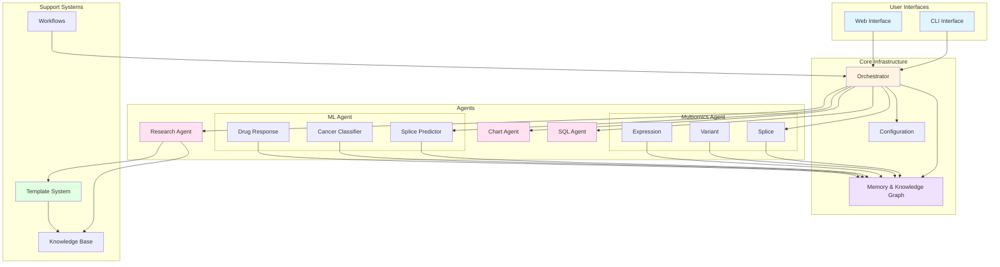
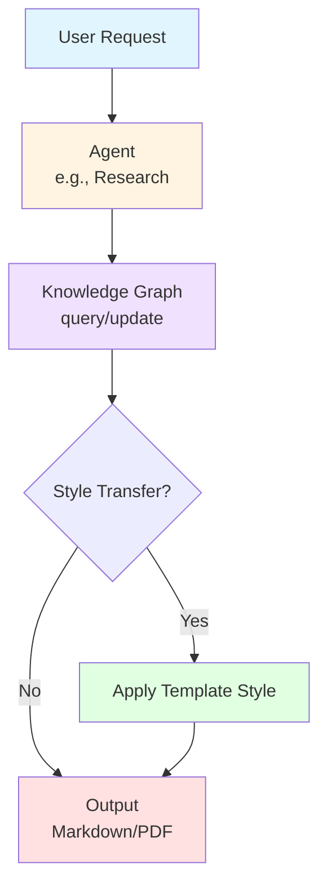
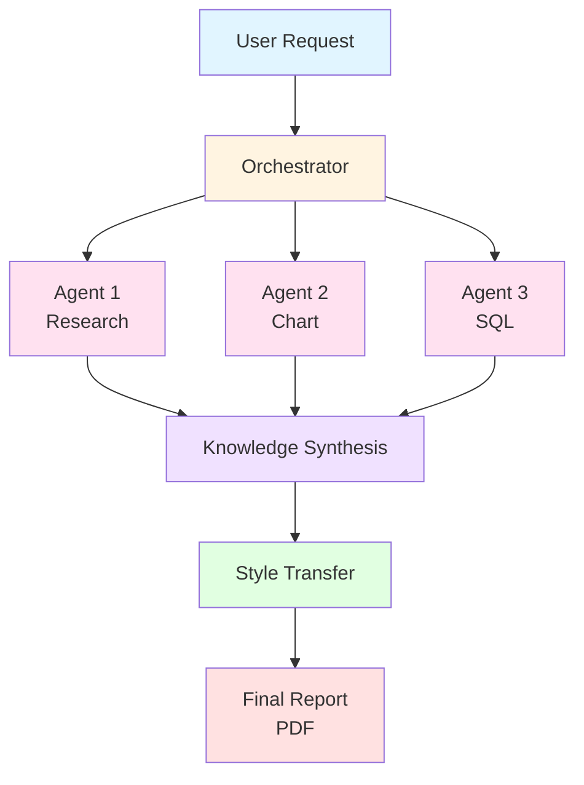

# Nexus Architecture

## Overview

Nexus is designed as a modular, extensible platform for orchestrating multiple AI agents to conduct scientific research. The architecture emphasizes:

- **Agent Independence**: Each agent is self-contained and can operate standalone
- **Shared Infrastructure**: Common utilities and services reduce duplication
- **Orchestration**: Coordinate multiple agents for complex workflows
- **Style Transfer**: Generate reports matching template paper styles
- **Knowledge Integration**: Build and query a unified knowledge graph

## System Architecture



## System Components

### Core Infrastructure (`core/`)

The foundation layer providing shared functionality:

- **`agent_base.py`**: Base class defining the agent interface
- **`orchestrator.py`**: Multi-agent coordination and workflow execution
- **`memory.py`**: Shared memory and knowledge graph
- **`config.py`**: Unified configuration management
- **`utils.py`**: Common utilities (logging, file I/O, etc.)
- **`types.py`**: Shared type definitions and data models

### Agents (`agents/`)

Individual AI agents, each specialized for specific tasks:

```
agents/
├── research/     # Literature review and report generation
├── chart/        # Data visualization and analysis
├── sql/          # Database querying
├── splice/       # Genomic sequence analysis
├── ml/           # Machine learning and predictions
└── email/        # Communication and collaboration
```

Each agent follows a consistent structure:
- Self-contained implementation
- Standardized interface via `AgentBase`
- Agent-specific documentation in `docs/`
- Independent configuration

### Workflows (`workflows/`)

Multi-agent pipelines that coordinate agents:

- **Research Pipeline**: Research → Chart → SQL for comprehensive analysis
- **Discovery Pipeline**: Iterative research with hypothesis testing
- **Analysis Pipeline**: Data-focused workflows

Workflows define:
- Agent execution order
- Data flow between agents
- Error handling and recovery
- Output aggregation

### Templates (`templates/`)

Paper-based style transfer system:

```
templates/
├── style_transfer.py      # Core style transfer engine
├── section_analyzer.py    # Extract structure from papers
├── structure_mapper.py    # Map content to template
├── papers/                # Template paper repository
│   ├── openspliceai.pdf
│   └── metadata/
│       └── openspliceai.json
└── presets/               # Journal/conference presets
    ├── nature.py
    └── science.py
```

**Style Transfer Process:**
1. Analyze template paper (structure, sections, style)
2. Generate research content
3. Map content to template structure
4. Apply formatting and citation style
5. Output styled report

### Knowledge Management (`knowledge/`)

Unified knowledge across all agents:

- **Knowledge Graph**: Store and query research findings
- **Retrieval System**: Semantic search and RAG
- **Synthesis Engine**: Combine insights from multiple agents
- **Experimental Results**: Aggregate results from credible sources

### Server (`server/`)

Web interface for all agents and workflows:

```
server/
├── main.py              # FastAPI application
├── routes/
│   ├── research.py      # Research agent endpoints
│   ├── templates.py     # Template management
│   └── orchestration.py # Workflow endpoints
├── templates/           # HTML templates
└── static/              # CSS, JS, assets
```

### CLI (`cli/`)

Command-line interface:

```bash
# Single agent
nexus research "topic" --template papers/nature.pdf

# Multi-agent workflow
nexus orchestrate --workflow discovery --topic "CRISPR"

# Template management
nexus template add papers/my_paper.pdf
nexus template list
```

## Data Flow

### Single Agent Execution



### Multi-Agent Workflow



## Agent Interface

All agents implement the `AgentBase` interface:

```python
class AgentBase(ABC):
    """Base class for all Nexus agents."""
    
    @abstractmethod
    def execute(self, task: Task) -> Result:
        """Execute the agent's primary function."""
        pass
    
    @abstractmethod
    def validate_input(self, task: Task) -> bool:
        """Validate input before execution."""
        pass
    
    def get_capabilities(self) -> List[str]:
        """Return list of agent capabilities."""
        pass
```

## Configuration

Unified configuration system:

```python
# config.py
class NexusConfig:
    # API keys
    OPENAI_API_KEY: str
    ANTHROPIC_API_KEY: str
    
    # Paths
    OUTPUT_DIR: Path
    TEMPLATE_DIR: Path
    KNOWLEDGE_DIR: Path
    
    # Agent settings
    DEFAULT_MODEL: str
    MAX_TOKENS: int
    
    # Orchestration
    MAX_PARALLEL_AGENTS: int
    TIMEOUT_SECONDS: int
```

## Extensibility

### Adding New Agents

1. Create agent directory: `agents/my_agent/`
2. Implement `AgentBase` interface
3. Add agent-specific logic
4. Register in orchestrator
5. Add CLI/API endpoints
6. Document in `docs/agents/`

### Adding New Workflows

1. Create workflow file: `workflows/my_workflow.py`
2. Define agent sequence and data flow
3. Implement error handling
4. Add CLI command
5. Document in `docs/workflows/`

### Adding Template Papers

1. Add PDF to `templates/papers/`
2. Run analyzer to extract metadata
3. Review/edit metadata JSON
4. Template is now available for use

## Performance Considerations

- **Parallel Execution**: Multiple agents can run concurrently
- **Caching**: Knowledge graph caches common queries
- **Streaming**: Large reports stream to avoid memory issues
- **Rate Limiting**: Respect API rate limits across agents

## Security

- API keys stored in environment variables
- Input validation on all agent inputs
- Sandboxed execution for code-generating agents
- Audit logging for all operations

## Future Enhancements

- Real-time collaboration between agents
- Federated learning across agent instances
- Advanced reasoning with chain-of-thought
- Interactive refinement of outputs
- Integration with lab equipment and databases
